# Enterprise AI Agent Platform

A local-first, open-source platform for composing, deploying, and managing autonomous AI agents with tool calling, vector memory, multi-agent routing, and full audit trails — all running on a single machine via Docker Compose.

> **Designed for local development on Apple Silicon (M4 Max, 128 GB RAM).**
> Kubernetes-ready: every service is stateless, health-checked, and env-var configured.

---

## Table of Contents

- [System Architecture](#system-architecture)
- [Gateway Architecture](#gateway-architecture)
- [Control Plane Design](#control-plane-design)
- [Execution Plane Design](#execution-plane-design)
- [Tool Call Execution Model](#tool-call-execution-model)
- [Orchestration / Control Plane Decoupling](#orchestration--control-plane-decoupling)
- [Session Service Architecture](#session-service-architecture)
- [Tenant Isolation Boundary](#tenant-isolation-boundary)
- [Agent Turn Lifecycle](#agent-turn-lifecycle)
- [LangGraph Agent Graph](#langgraph-agent-graph)
- [Memory Architecture](#memory-architecture)
- [Multi-Agent Routing](#multi-agent-routing)
- [Audit Pipeline](#audit-pipeline)
- [Web UI Architecture](#web-ui-architecture)
- [Database Schema](#database-schema)
- [Redis Key Reference](#redis-key-reference)
- [Services](#services)
- [Quick Start](#quick-start)
- [Configuration](#configuration)
- [API Reference](#api-reference)
- [Running the Test Suite](#running-the-test-suite)
- [Observability](#observability)
- [Changing the LLM Model](#changing-the-llm-model)
- [Production Path](#production-path)
- [Cloud Uplift](#cloud-uplift)
- [Known Constraints](#known-constraints)
- [Future Plans](#future-plans)
- [Open Source Stack](#open-source-stack)

---

## System Architecture

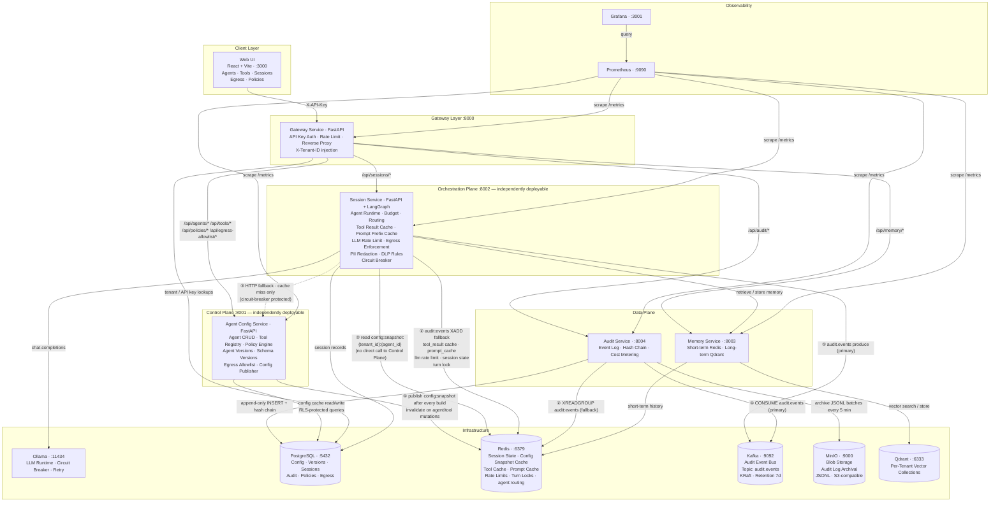

> **Solid arrows** = primary (hot) path. **Dashed arrow** = fallback (cold start / post-mutation / TTL expiry only). **① → ② → ③** = config decoupling: Control Plane publishes to Redis; Orchestration Plane reads from Redis directly; HTTP fallback to Control Plane only on cache miss.

---

## Gateway Architecture

The gateway is the single public entry point. It enforces authentication, rate limits, and routes requests to the correct backend service — no business logic lives here.

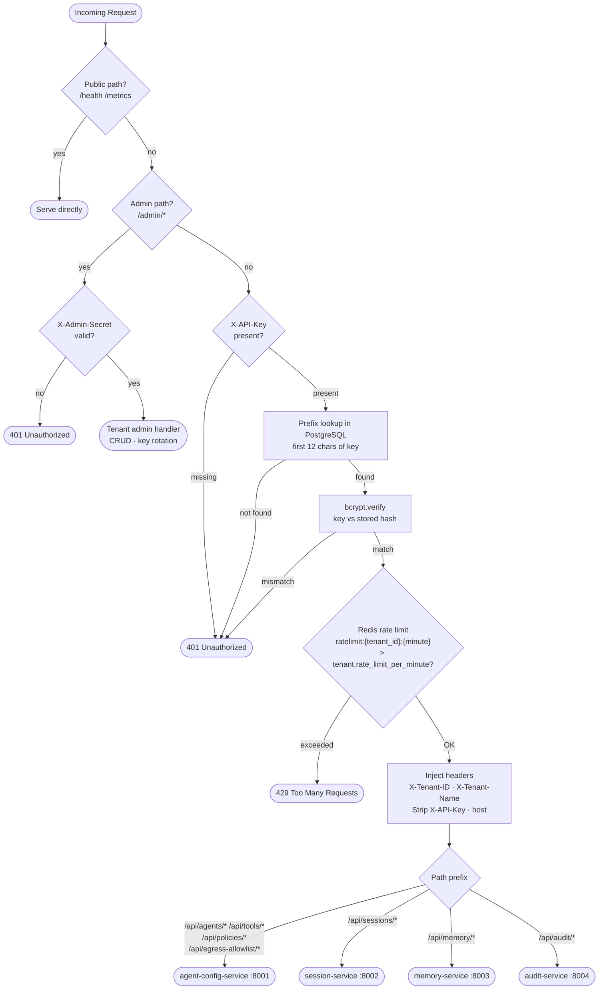

**Rate limiting** (Redis sliding window):
- Key: `ratelimit:{tenant_id}:{unix_minute}` · INCR on each request · TTL = 60 s
- Limit from `tenant.rate_limit_per_minute` in PostgreSQL
- Fails **open** if Redis is unavailable — requests pass through

**Request forwarding:**
- Strips: `x-api-key`, `host`, `content-length`, `transfer-encoding`
- Adds: `X-Tenant-ID`, `X-Tenant-Name`
- Preserves: method, path, query string, body
- HTTP client pool: 200 max connections, 50 keepalive, 60 s overall / 5 s connect timeout
- Responses streamed back without buffering
- Upstream connection failure → 502 · upstream timeout → 504

---

## Control Plane Design

The Control Plane (`agent-config-service`) manages all configuration, versioning, and policy objects. Every write creates an immutable record; the session service reads from a published Redis snapshot rather than querying the control plane directly at runtime.

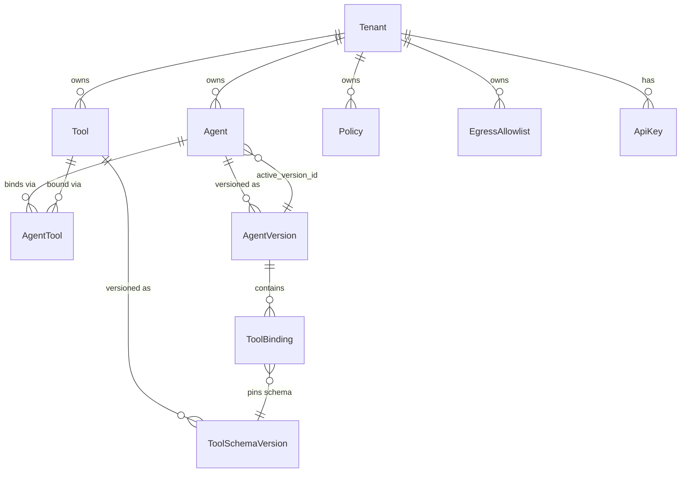

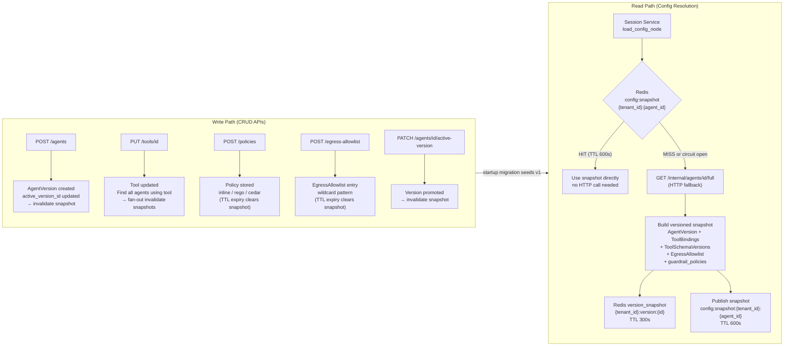

**Config cache layers** (all Redis keys tenant-prefixed):

| Key | Written by | Read by | TTL | Purpose |
|---|---|---|---|---|
| `config:snapshot:{tenant_id}:{agent_id}` | agent-config-service | **session-service (primary)** | 600 s | Decoupled config snapshot |
| `{tenant_id}:config:agent:{agent_id}:active_version` | agent-config-service | agent-config-service | 30 s | Active version UUID |
| `{tenant_id}:config:version:{version_id}` | agent-config-service | agent-config-service | 300 s | Full versioned config |
| `{tenant_id}:config:tools:{version_id}` | agent-config-service | agent-config-service | 300 s | Tool array for version |

---

## Execution Plane Design

The Execution Plane encompasses everything that happens inside a single agent turn: tool invocation, LLM inference, and output filtering.

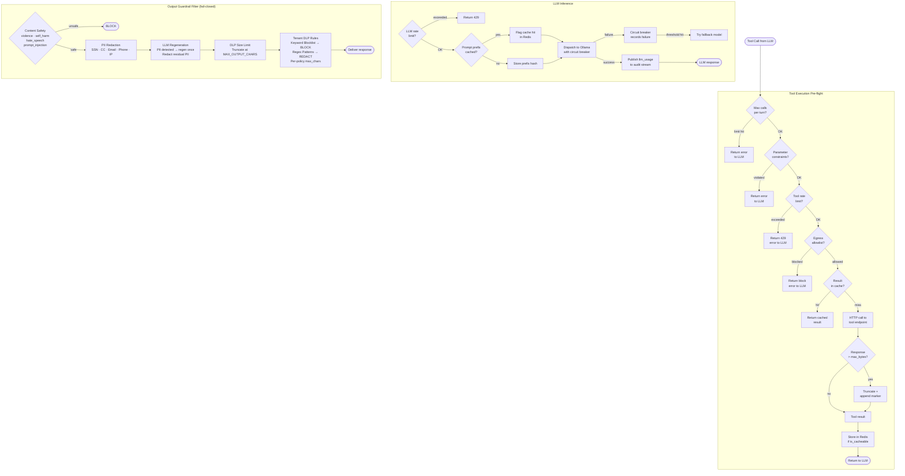

---

## Tool Call Execution Model

Tools in this platform are **external microservices**, not local functions. There is no OS-level sandbox or subprocess spawning inside the session-service. Isolation is achieved through network-level boundaries: the session-service dispatches an async HTTP call to the tool's configured endpoint and enforces a layered set of pre-flight controls before the call is made.

### Isolation model

| Mechanism | How it works |
|---|---|
| **Network isolation** | Tools live at independently deployed HTTP endpoints; the session-service never executes tool code locally |
| **Egress allowlist** | `fnmatch` pattern check on hostname, port, and protocol before every call — blocked calls return an error to the LLM |
| **Parameter constraints** | `enum`, `min`, `max`, `pattern`, `allowed_prefixes` validated locally before the endpoint is called |
| **Tool rate limit** | Per-tenant, per-tool sliding window in Redis — exceeds limit returns 429 error to LLM |
| **Response size cap** | Tool responses truncated at `tool.max_response_bytes` (default `MAX_TOOL_RESPONSE_BYTES`) with a marker appended |
| **Result cache** | Deterministic calls cached in Redis under `{tenant_id}:tool_result:{tool_name}:{param_hash}` — cache TTL set per tool |

The remote endpoint is fully responsible for its own execution model (container, serverless, etc.). The session-service only controls what it calls, how it calls it, and what it accepts back.

### Dispatch flow

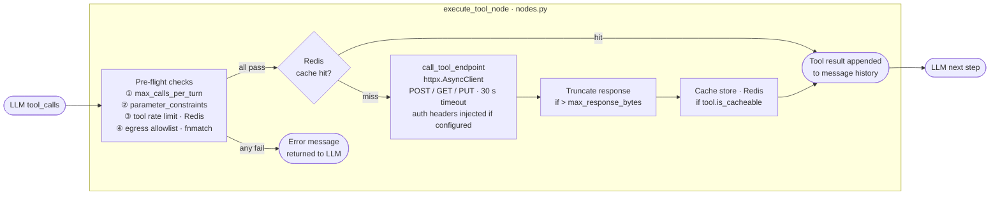

**Key files:**
- `session-service/app/agent/nodes.py` — `execute_tool_node()` orchestrates pre-flight, dispatch, and post-processing
- `session-service/app/agent/tools.py` — `call_tool_endpoint()` performs the async HTTP call with retry and auth injection

---

## Orchestration / Control Plane Decoupling

The orchestration plane (session-service) and control plane (agent-config-service) are **independently deployable** — session-service does not require agent-config-service to be running at runtime after the first warm-up.

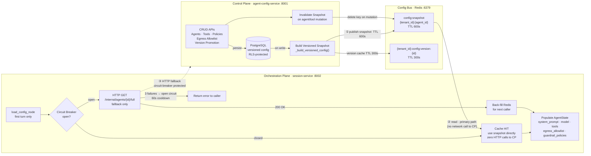

### Decoupling guarantees

| Scenario | Behaviour |
|---|---|
| Normal operation (warm cache) | session-service reads Redis snapshot — zero HTTP calls to agent-config-service |
| Agent config mutated | agent-config-service invalidates snapshot immediately; next session fetches fresh via HTTP and re-warms Redis |
| agent-config-service goes down after warm-up | session-service serves from Redis snapshot for up to 600 s |
| agent-config-service down from cold start | Circuit breaker fires after 3 failures (60 s cooldown); session returns error |
| Redis unavailable | ConfigClient falls back to HTTP on every call (no caching) |
| Tool mutation (fan-out) | All agents using the tool have their snapshots invalidated |
| Version promotion | Agent snapshot invalidated immediately; next call fetches new version |

---

## Tenant Isolation Boundary

Defense-in-depth isolation across all seven planes. A request from Tenant A cannot read, write, or affect Tenant B's data or compute at any layer.

```mermaid
flowchart TB
    EXT([External Request]) --> L1

    subgraph L1["L1 · Auth Boundary — Gateway :8000"]
        AUTH["API Key → SHA-256 hash lookup\nX-API-Key validates to exactly one tenant\nInvalid key → 401 before any service call"]
        RLIMIT["Per-tenant rate limit\nRedis INCR ratelimit:{tenant_id}:minute\nExceeds limit → 429"]
    end

    L1 --> L2

    subgraph L2["L2 · Control Plane Isolation — Agent Config Service"]
        HEADER["X-Tenant-ID injected by Gateway\nAll CRUD queries WHERE tenant_id = X-Tenant-ID"]
        RLS["PostgreSQL Row Level Security\nCREATE POLICY tenant_isolation\nUSING tenant_id = current_setting app.current_tenant_id\nCovers: agents · agent_versions · tool_bindings\npolicies · egress_allowlist · roles · api_keys"]
        RCACHE2["Redis config cache keys — all tenant-scoped\nconfig:snapshot:{tenant_id}:{agent_id}  ← published snapshot\n{tenant_id}:config:agent:{id}:active_version\n{tenant_id}:config:version:{id}:snapshot\n{tenant_id}:config:tools:{id}:{ver}"]
        INV2["Snapshot invalidation is tenant-scoped\nAgent/tool mutations only clear own tenant keys"]
    end

    L2 --> L3

    subgraph L3["L3 · Session Isolation — Session Service"]
        SKEY2["Redis state key scoped by tenant\n{tenant_id}:session:{session_id}:state\nPrevents cross-tenant state access"]
        LOCK2["Distributed turn lock scoped by tenant\nturn:lock:{tenant_id}:{session_id}\nPrevents concurrent turn corruption"]
        ACTV2["Activity sorted set scoped\n{tenant_id}:sessions:by_activity\nTenant sees only own sessions"]
        DBCHECK["DB session lookup enforces\nWHERE tenant_id = X-Tenant-ID → 403 on mismatch"]
    end

    L3 --> L4

    subgraph L4["L4 · LLM Rate Limiting"]
        LLMRL["Redis sliding window per tenant\nratelimit:llm:{tenant_id}:minute\nExceeds MAX_LLM_REQUESTS_PER_MINUTE → 429 error msg to LLM"]
        PCACHE["Prompt prefix cache tenant-scoped\n{tenant_id}:prompt_cache:{sha256_hash}\nNo cross-tenant cache sharing"]
    end

    L4 --> L5

    subgraph L5["L5 · Tool Execution Isolation"]
        MAXCALLS["Max calls per turn enforced from\nagent version ToolBinding.max_calls_per_turn"]
        PARAMS["Parameter constraints from ToolBinding\nenum · max · min · allowed_prefixes · pattern"]
        TRATE2["Tool call rate limit per tenant+tool\n{tenant_id}:ratelimit:tool:{tool_id}:minute\nExceeds MAX_TOOL_CALLS_PER_MINUTE → error"]
        EGRESS2["Egress allowlist enforcement\nfnmatch hostname · port · protocol check\nDefault-OPEN if no entries configured\nBlocked → error returned to LLM"]
        TCACHE2["Tool result cache tenant-scoped\n{tenant_id}:tool_result:{tool_name}:{param_hash}\nTTL = tool.cache_ttl_seconds"]
        TSIZE["Tool response size cap\ntool.max_response_bytes or MAX_TOOL_RESPONSE_BYTES\nTruncated with marker"]
    end

    L5 --> L6

    subgraph L6["L6 · Output Guardrail Filter"]
        CKSAFE["Content Safety Check — Layer 0\nviolence · self_harm · hate_speech · prompt_injection\nRegex pattern match → BLOCK immediately"]
        PIIRED["PII Redaction — Layer 1\nSSN → REDACTED-SSN\nCredit Card → REDACTED-CC\nEmail → REDACTED-EMAIL\nPhone → REDACTED-PHONE\nIP Address → REDACTED-IP"]
        REGEN["LLM Regeneration — Layer 2\nPII detected → request one regen\nRedact residual PII in regen output"]
        DLPSIZE["DLP Size Limit — Layer 3\nTruncate at MAX_OUTPUT_CHARS = 8192"]
        DLPPOL["Tenant DLP Policies — Layer 4\nkeyword_blocklist → BLOCK response\nredact_patterns → REDACT in-place\nmax_output_chars → truncate"]
    end

    L6 --> L7

    subgraph L7["L7 · Audit & Memory Isolation"]
        AHASH2["Audit hash chain per tenant\nprev_hash = SHA-256 prev_hash + canonical_event\nNULL for first tenant event\nTamper-evident append-only log"]
        MEMSCOPE["Short-term memory scoped\nmemory:short:{tenant_id}:{session_id}\nQdrant collection per tenant\nmemory_{tenant_id}"]
        AUDSCOPE["All audit events tagged tenant_id\nQueries WHERE tenant_id = X-Tenant-ID\nTenant isolation verified in tests"]
    end

    L7 --> SAFE([Response delivered to tenant])
```

### Isolation mechanism summary

| Layer | Mechanism | Scope |
|---|---|---|
| **L1 Auth** | SHA-256 API key hash → single tenant lookup | Gateway |
| **L1 Rate limit** | Redis INCR `ratelimit:{tenant_id}:minute` | Gateway |
| **L2 Data** | `WHERE tenant_id = X-Tenant-ID` on all queries | Agent Config |
| **L2 RLS** | PostgreSQL Row Level Security on 7 tables | Agent Config DB |
| **L2 Cache** | Redis keys `config:snapshot:{tenant_id}:*`, `{tenant_id}:config:*` | Agent Config |
| **L2 Invalidation** | Snapshot invalidation is tenant+agent scoped — no cross-tenant bleed | Agent Config |
| **L3 State** | Redis key `{tenant_id}:session:{id}:state` | Session |
| **L3 Lock** | Redis key `turn:lock:{tenant_id}:{session_id}` | Session |
| **L3 DB** | `WHERE tenant_id = X-Tenant-ID` + 403 on mismatch | Session DB |
| **L4 LLM rate** | Redis `ratelimit:llm:{tenant_id}:minute` | Session |
| **L4 Prompt cache** | Redis `{tenant_id}:prompt_cache:{hash}` | Session |
| **L5 Tool rate** | Redis `{tenant_id}:ratelimit:tool:{tool_id}:minute` | Session |
| **L5 Egress** | Allowlist fnmatch per tenant (default-open) | Session |
| **L5 Tool cache** | Redis `{tenant_id}:tool_result:{name}:{hash}` | Session |
| **L6 Content Safety** | Regex detection of violence, self-harm, hate speech, prompt injection → BLOCK | Session |
| **L6 PII** | 5-pattern regex redaction (SSN/CC/Email/Phone/IP), LLM regeneration on detect | Session |
| **L6 DLP** | Tenant policy keyword block + regex redact + size cap (`MAX_OUTPUT_CHARS`) | Session |
| **L7 Audit** | Hash chain `SHA-256(prev_hash + event)` per tenant | Audit |
| **L7 Memory** | Redis `memory:short:{tenant_id}:*`, Qdrant `memory_{tenant_id}` | Memory |

---

## Agent Turn Lifecycle

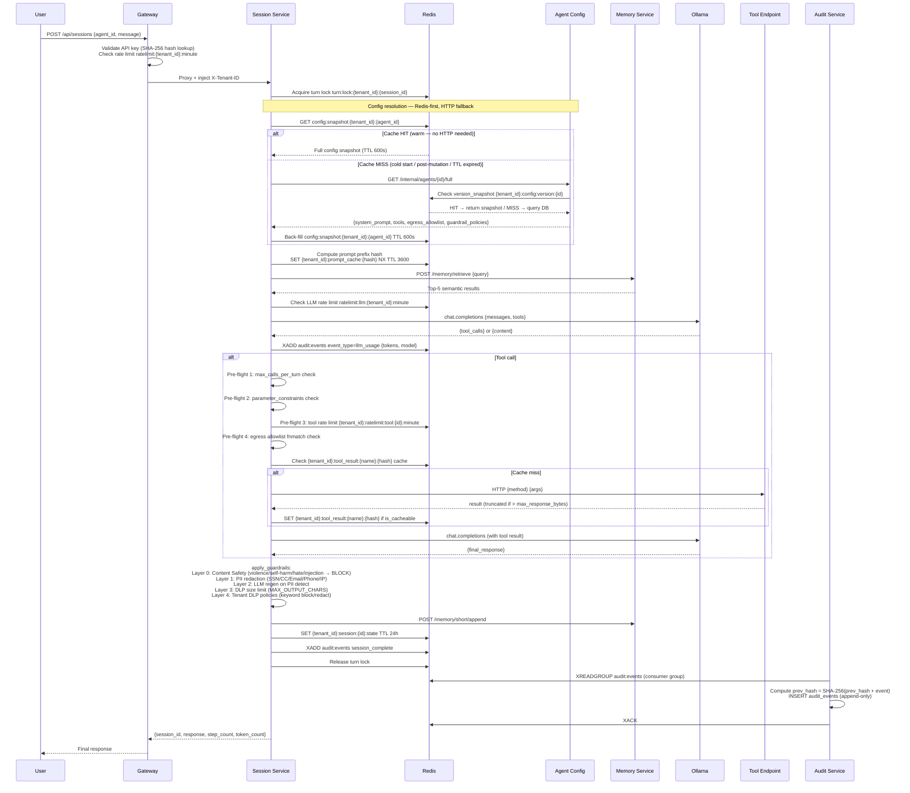

---

## LangGraph Agent Graph

Each agent turn runs as a compiled LangGraph `StateGraph`. Edges are conditional; the graph short-circuits on errors or budget exhaustion.

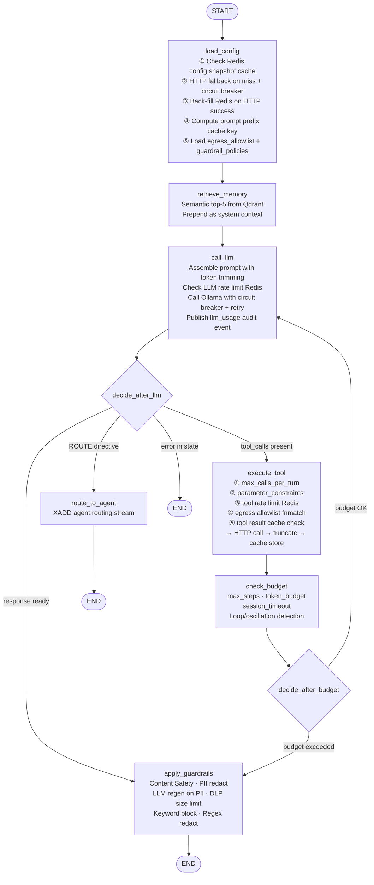

### Node descriptions

| Node | Responsibility |
|---|---|
| **load_config** | Resolve agent config via cache-aside: check Redis `config:snapshot:{tenant_id}:{agent_id}` (TTL 600 s) first; fall back to HTTP call to agent-config-service (circuit-breaker protected, 3 failures → 60 s cooldown); back-fill Redis on HTTP success. Compute SHA-256 prompt prefix cache key and store in Redis. Skips entirely on multi-turn continuation. |
| **retrieve_memory** | If `memory_enabled`, query Qdrant tenant collection for top-5 semantic matches on the last user message. Prepend results as system context message. |
| **call_llm** | Assemble prompt with priority-ordered token trimming (recent > memory > older). Check Redis LLM rate limit. Call Ollama via circuit breaker + exponential-backoff retry. Publish `llm_usage` event to audit stream. |
| **execute_tool** | Four pre-flight checks before each HTTP call: ① max_calls_per_turn, ② parameter_constraints (enum/max/min/prefix/pattern), ③ per-tenant tool rate limit (Redis INCR), ④ egress allowlist (fnmatch). Check tenant-scoped tool result cache before calling. Truncate response at `max_response_bytes`. Store result in cache if `is_cacheable`. |
| **check_budget** | Enforce `max_steps`, `token_budget`, `session_timeout_seconds`. Detect degenerate tool loops (same call ×3) and A→B→A→B oscillations. |
| **apply_guardrails** | Layer 0: Content Safety — regex detection of violence, self-harm, hate speech, and prompt-injection patterns → BLOCK immediately. Layer 1: PII redaction (SSN, CC, email, phone, IP). Layer 2: LLM regeneration on PII detect (one attempt; redact residual PII). Layer 3: DLP size limit (`MAX_OUTPUT_CHARS`). Layer 4: Tenant DLP policies (keyword blocklist → BLOCK, regex → REDACT, per-policy max chars). Fail-closed: scanner exception → block response. |
| **route_to_agent** | Detect `[ROUTE:target_agent_id]` in response. Publish routing event to `agent:routing` Redis Stream. |

---

## Session Service Architecture

The session service has four internal clients — each handles one cross-cutting concern — wired into the LangGraph graph.

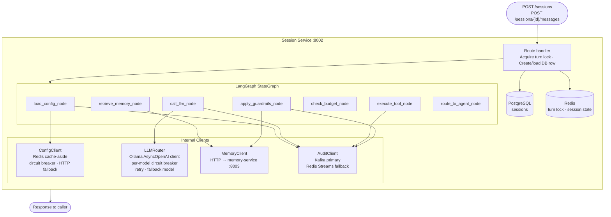

### ConfigClient — cache-aside resolution order

```
1. Redis GET  config:snapshot:{tenant_id}:{agent_id}
   └── HIT  → deserialise and return immediately (zero network calls)
   └── MISS → continue

2. Circuit breaker open? (3 failures within 60 s window)
   └── OPEN  → return error state to graph

3. HTTP GET  /internal/agents/{id}/full
             X-Internal-Secret header  ·  10 s timeout
   └── 200  → back-fill Redis (TTL 600 s) → return config
   └── 404  → NOT a circuit failure (definitive answer)
   └── 5xx/timeout → record failure; 3rd failure opens circuit for 60 s
```

### LLMRouter — per-model circuit breaker + retry

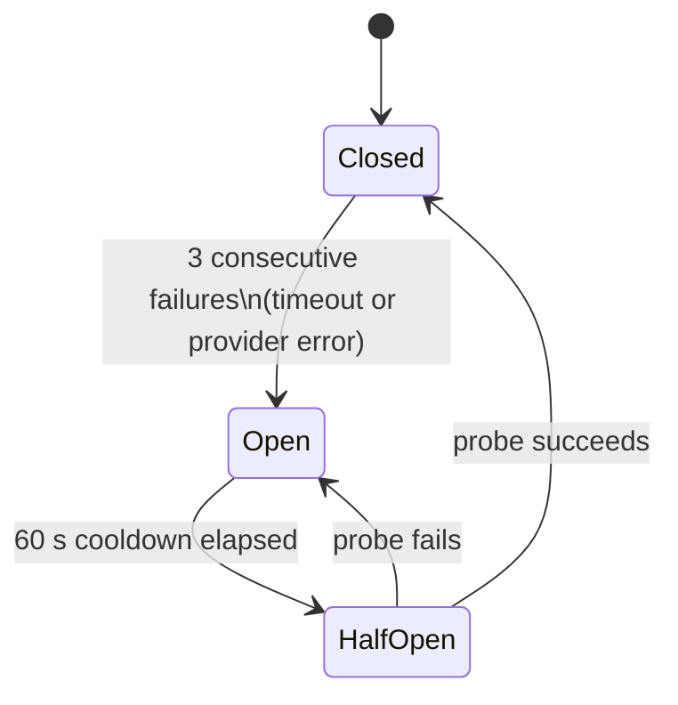

**Per-call retry policy:**

| Attempt | Backoff | `NotFoundError` | `RateLimitError` / `APIStatusError` |
|---|---|---|---|
| 1st | — | skip to fallback model immediately | retry with backoff |
| 2nd | 2¹ + jitter s | — | retry with backoff |
| 3rd | 2² + jitter s | — | raise |
| Fallback | try `FALLBACK_MODEL` if configured and different | — | raise |

`NotFoundError` (model not loaded in Ollama) does **not** increment the circuit-breaker failure count — it is a definitive answer, not a transient fault.

---

## Memory Architecture

```mermaid
flowchart LR
    subgraph Short["Short-Term (Redis)"]
        direction TB
        SK["Key: memory:short:{tenant_id}:{session_id}"]
        SL["JSON list — 50 message max"]
        ST["TTL: 24 hours"]
    end

    subgraph Long["Long-Term (Qdrant)"]
        direction TB
        LK["Collection: memory_{tenant_id}"]
        LE["Embedding: all-MiniLM-L6-v2 · 384-dim"]
        LS["Similarity: COSINE > 0.4"]
    end

    U([User message]) --> RM[retrieve_memory node]
    RM -->|semantic search top-5| Long
    Long -->|context prepended| LLM[call_llm node]
    LLM --> Response
    Response --> SA["POST /memory/short/append"]
    SA --> Short
    Response --> SE["POST /memory/session/end"]
    SE -->|last 10 msgs embedded| Long
    SE -->|clear session| Short
```

**Short-term memory** stores raw message history in Redis per `{tenant_id}:{session_id}`. Evicted after 24 hours or 50 messages. No cross-tenant key collisions.

**Long-term memory** stores semantically embedded assistant messages in a per-tenant Qdrant collection (`memory_{tenant_id}`). Retrieved at session start; consolidated at session end.

---

## Multi-Agent Routing

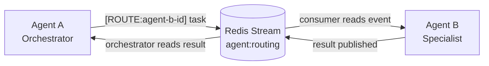

When the LLM response begins with `[ROUTE:agent_id]`, the session service:

1. Extracts target agent ID and message from the response
2. Publishes to `agent:routing` Redis Stream: `{tenant_id, source_session_id, target_agent_id, message, timestamp}`
3. Terminates the current graph run with a "Task routed" response

A consumer (separate agent session or worker) reads from `agent:routing`, creates a new session, and publishes the result back.

---

## Audit Pipeline

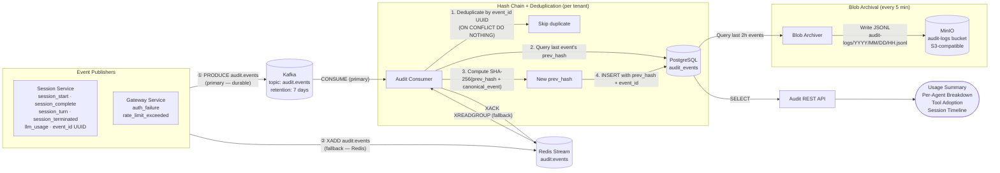

Every audit event carries a `prev_hash` field: `SHA-256(prev_hash_of_previous_event + canonical_JSON_of_previous_event)`. The first event per tenant has `prev_hash = NULL`. This creates a per-tenant tamper-evident hash chain — any modification to a historical record breaks all subsequent hashes.

---

## Web UI Architecture

Single-page React + Vite application on port 3000. Communicates exclusively with the gateway — no direct calls to backend services.

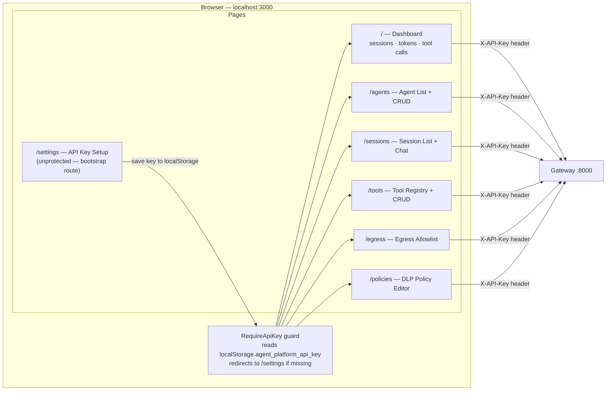

`/settings` is intentionally unprotected — it is the bootstrap route where users paste their tenant API key. All other pages redirect to `/settings` if no key is found in `localStorage`.

---

## Database Schema

All tables live in a single PostgreSQL database (`agentplatform`). Each service owns its own tables. Row Level Security (RLS) is enabled on all tenant-scoped tables in the agent-config-service. The memory service has no PostgreSQL tables — it uses Redis and Qdrant exclusively.

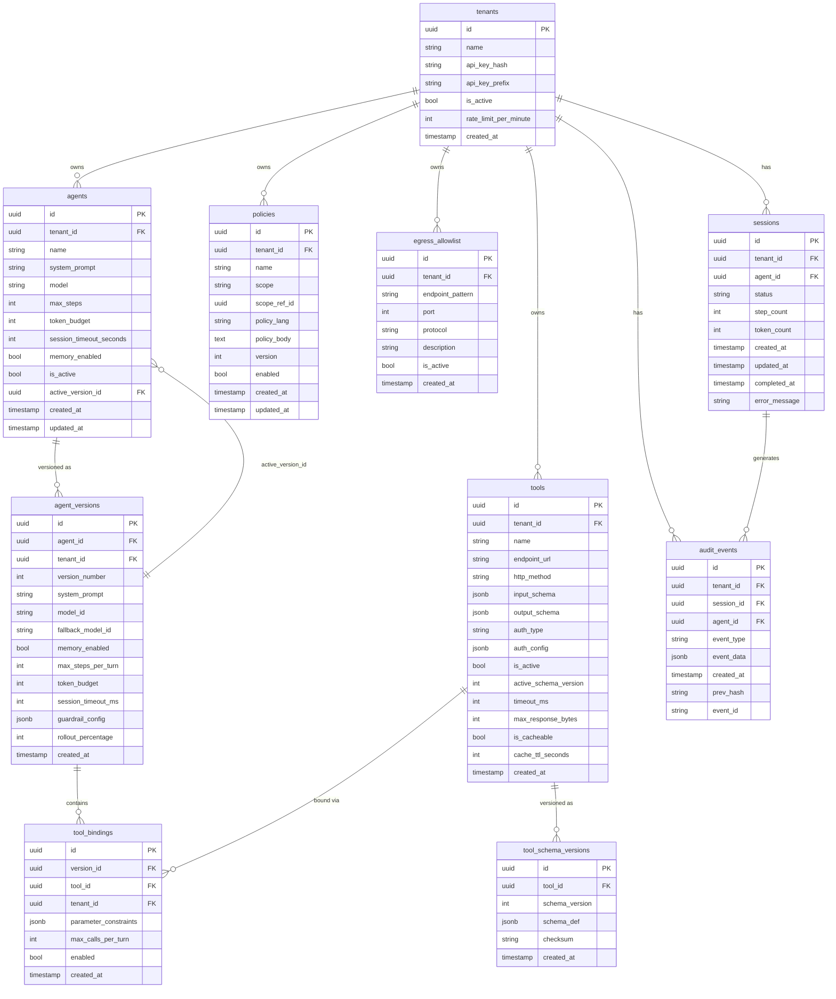

**Notable column behaviours:**
- `tool_bindings.parameter_constraints` (JSONB): `{param_name: {enum, max, min, allowed_prefixes, pattern}}` — enforced by session-service pre-flight before each tool call
- `audit_events.prev_hash`: `SHA-256(prev_event.prev_hash + canonical_JSON(prev_event))` — tamper-evident hash chain per tenant
- `audit_events.event_id`: UUID dedup key — `ON CONFLICT DO NOTHING` prevents double-processing when Kafka and Redis both deliver the same event
- `agent_versions.guardrail_config` (JSONB): per-version override for content-safety and PII settings

---

## Redis Key Reference

Every key is tenant-scoped to prevent cross-tenant access. The owning service is the only writer; other services are read-only consumers.

### Gateway

| Key | Type | TTL | Written by | Purpose |
|---|---|---|---|---|
| `ratelimit:{tenant_id}:{unix_minute}` | INCR | 60 s | Gateway | Per-tenant request rate limit counter |

### Agent Config Service (Control Plane)

| Key | Type | TTL | Written by | Purpose |
|---|---|---|---|---|
| `config:snapshot:{tenant_id}:{agent_id}` | string (JSON) | 600 s | Agent Config | Full config snapshot — primary read path for session-service |
| `{tenant_id}:config:agent:{agent_id}:active_version` | string (UUID) | 30 s | Agent Config | Active version UUID |
| `{tenant_id}:config:version:{version_id}` | string (JSON) | 300 s | Agent Config | Full versioned config (AgentVersion + ToolBindings + schemas) |
| `{tenant_id}:config:tools:{version_id}` | string (JSON) | 300 s | Agent Config | Tool array for a version |

### Session Service (Orchestration Plane)

| Key | Type | TTL | Written by | Purpose |
|---|---|---|---|---|
| `turn:lock:{tenant_id}:{session_id}` | SET NX | 30 s | Session | Distributed turn lock — prevents concurrent turns on same session |
| `{tenant_id}:session:{session_id}:state` | string (JSON) | 24 h | Session | Conversation state between turns |
| `{tenant_id}:sessions:by_activity` | sorted set | none | Session | Sessions sorted by last activity timestamp (used for list queries) |
| `ratelimit:llm:{tenant_id}:{unix_minute}` | INCR | 60 s | Session | Per-tenant LLM call rate limit |
| `{tenant_id}:prompt_cache:{sha256_hash}` | string | 3600 s | Session | Prompt prefix cache hit flag |
| `{tenant_id}:ratelimit:tool:{tool_id}:{unix_minute}` | INCR | 60 s | Session | Per-tenant per-tool call rate limit |
| `{tenant_id}:tool_result:{tool_name}:{param_hash}` | string (JSON) | `tool.cache_ttl_seconds` | Session | Cached tool call response |
| `agent:routing` | stream (XADD) | none | Session | Inter-agent routing directives |

### Audit Service

| Key | Type | TTL | Written by | Purpose |
|---|---|---|---|---|
| `audit:events` | stream (XADD / XREADGROUP) | none | Session (write), Audit (read) | Fallback audit event bus when Kafka is unavailable |

### Memory Service

| Key | Type | TTL | Written by | Purpose |
|---|---|---|---|---|
| `{tenant_id}:{session_id}:messages` | list (JSON) | 24 h | Memory | Short-term session message history (max 50 messages, oldest evicted on overflow) |

---

## Services

| Service | Port | Role |
|---|---|---|
| `gateway-service` | 8000 | Public entry point: SHA-256 API key auth, per-tenant rate limiting, reverse proxy for all backend routes |
| `agent-config-service` | 8001 | Agent CRUD + immutable versioning, tool registry + schema versioning, policy engine (inline/rego/cedar stubs), egress allowlist CRUD, config snapshot publisher |
| `session-service` | 8002 | LangGraph agent runtime, multi-turn sessions, tool pre-flight enforcement, LLM circuit breaker + retry, tool result cache, prompt prefix cache, PII + DLP guardrails, config cache consumer with circuit breaker |
| `memory-service` | 8003 | Redis short-term message history + Qdrant long-term semantic memory per tenant |
| `audit-service` | 8004 | Kafka consumer (primary) + Redis Streams fallback, append-only audit log with hash chain, event deduplication by UUID, MinIO blob archival every 5 min, cost metering, usage APIs |
| `web-ui` | 3000 | React UI: agent builder, tool registry, session monitor, egress allowlist manager, DLP policy editor |
| `ollama` | 11434 | Local LLM runtime (llama3.2 default, any GGUF model) |
| `postgres` | 5432 | Config, agent versions, session records, policies, egress allowlist, audit log |
| `redis` | 6379 | Session state, config snapshot cache, tool result cache, prompt cache, rate limits, Streams, turn locks |
| `kafka` | 9092 | Audit event bus (KRaft, single broker, topic `audit.events`, 7-day retention) |
| `minio` | 9000/9001 | S3-compatible blob storage for audit log archival (JSONL, partitioned by hour) |
| `qdrant` | 6333 | Per-tenant vector collections for long-term memory |
| `prometheus` | 9090 | Metrics scraping from all services |
| `grafana` | 3001 | Pre-provisioned dashboards |

---

## Quick Start

### Prerequisites

| Tool | Minimum version | Purpose |
|---|---|---|
| Docker Desktop | 4.x | Container runtime |
| Docker Compose | v2 (bundled with Docker Desktop) | Orchestrate all services |
| `curl` | any | API examples below |
| `jq` | any | Pretty-print JSON responses |
| Python | 3.12+ | Running the E2E test suite (optional) |

**Disk:** ~20 GB free for Docker images + Ollama model weights. Allocate at least 16 GB RAM to Docker Desktop.

---

### 1. Clone the repo

```bash
git clone <repo-url> enterprise-ai-agent-platform
cd enterprise-ai-agent-platform
```

---

### 2. Configure environment variables

```bash
cp .env.example .env
```

Open `.env` and change every value that contains `changeme-`:

```
POSTGRES_PASSWORD=changeme-postgres     → set a real password
ADMIN_SECRET=changeme-admin-secret      → gateway admin secret
INTERNAL_SECRET=changeme-internal-secret → inter-service auth
GF_SECURITY_ADMIN_PASSWORD=changeme-grafana → Grafana password
```

Everything else has working defaults for local development. Full variable reference is in the [Configuration](#configuration) section.

---

### 3. Start the full stack

```bash
docker compose up -d
```

**First-run startup sequence and expected times:**

| Phase | What happens | Approx. time |
|---|---|---|
| Image pull + build | Docker pulls base images; builds 5 Python service images | 3–5 min |
| Infrastructure ready | PostgreSQL, Redis, Kafka, MinIO, Qdrant all pass health checks | 30–60 s |
| Ollama model pull | `llama3.2` (~2 GB) downloaded inside the Ollama container | 2–5 min |
| Memory service ready | `all-MiniLM-L6-v2` sentence-transformer loaded (120 s start_period) | 2 min |
| All services healthy | Gateway, Config, Session, Memory, Audit pass health checks | ~10 min total |

Subsequent starts take under 30 seconds because images are cached and model weights are on a Docker volume.

---

### 4. Verify the stack is healthy

```bash
# All five services should return {"status": "ok"}
for port in 8000 8001 8002 8003 8004; do
  echo -n "http://localhost:$port/health → "
  curl -s http://localhost:$port/health | python3 -c "import sys,json; d=json.load(sys.stdin); print(d.get('status','?'))"
done
```

Or check Docker Compose directly:

```bash
docker compose ps          # all services should show "healthy" or "running"
docker compose logs -f     # stream all logs
docker compose logs -f session-service   # stream a single service
```

---

### 5. Create your first tenant

```bash
curl -s -X POST http://localhost:8000/admin/tenants \
  -H "Content-Type: application/json" \
  -H "X-Admin-Secret: changeme-admin-secret" \
  -d '{"name": "Acme Corp", "rate_limit_per_minute": 60}' | jq
```

Save the `api_key` from the response — **it is shown only once**. You cannot recover it; rotate it with `POST /admin/tenants/{tenant_id}/rotate-key` if lost.

```bash
export API_KEY="tap_<your-api-key-here>"
```

---

### 6. Create an agent

```bash
curl -s -X POST http://localhost:8000/api/agents \
  -H "X-API-Key: $API_KEY" \
  -H "Content-Type: application/json" \
  -d '{
    "name": "My First Agent",
    "system_prompt": "You are a helpful assistant.",
    "model": "llama3.2",
    "max_steps": 10,
    "token_budget": 8000,
    "memory_enabled": true
  }' | jq
```

```bash
export AGENT_ID="<agent_id from response>"
```

---

### 7. (Optional) Register and bind a tool

```bash
# Register a tool endpoint
TOOL_ID=$(curl -s -X POST http://localhost:8000/api/tools \
  -H "X-API-Key: $API_KEY" \
  -H "Content-Type: application/json" \
  -d '{
    "name": "weather",
    "description": "Get current weather for a city",
    "endpoint_url": "https://wttr.in",
    "http_method": "GET",
    "input_schema": {"type":"object","properties":{"city":{"type":"string"}},"required":["city"]},
    "auth_type": "none",
    "is_cacheable": true,
    "cache_ttl_seconds": 300
  }' | jq -r '.id')

# Bind the tool to your agent and authorise it
curl -s -X POST "http://localhost:8000/api/agents/$AGENT_ID/tools/$TOOL_ID" \
  -H "X-API-Key: $API_KEY" | jq

curl -s -X PUT "http://localhost:8000/api/agents/$AGENT_ID/tools/$TOOL_ID/authorize" \
  -H "X-API-Key: $API_KEY" \
  -H "Content-Type: application/json" \
  -d '{"is_authorized": true}' | jq
```

---

### 8. Start a session

```bash
curl -s -X POST http://localhost:8000/api/sessions \
  -H "X-API-Key: $API_KEY" \
  -H "Content-Type: application/json" \
  -d "{\"agent_id\": \"$AGENT_ID\", \"message\": \"Hello! What can you help me with?\"}" | jq
```

Continue a session (multi-turn):

```bash
export SESSION_ID="<session_id from response>"

curl -s -X POST "http://localhost:8000/api/sessions/$SESSION_ID/messages" \
  -H "X-API-Key: $API_KEY" \
  -H "Content-Type: application/json" \
  -d '{"message": "Can you summarise what we discussed?"}' | jq
```

---

### 9. Open the Web UI

Navigate to **http://localhost:3000**

- **Settings** — paste your `API_KEY`
- **Agents** → **New Agent** to build agents visually
- **Tools** → register tool endpoints, set caching and auth
- **Egress** → restrict which external hosts agents may call
- **Policies** → create DLP rules (keyword blocklists, regex redaction, size caps)
- **Sessions** → chat interactively with any agent

---

### 10. View dashboards and consoles

| URL | Credentials | What's there |
|---|---|---|
| http://localhost:3001 | admin / changeme-grafana | Grafana — sessions, tokens, tool calls, budget hits, gateway RPS |
| http://localhost:9090 | — | Prometheus metrics explorer |
| http://localhost:9001 | minioadmin / minioadmin123 | MinIO console — browse audit log JSONL archives |
| http://localhost:8000/docs | — | OpenAPI / Swagger UI for all gateway routes |

---

### 11. Run the E2E test suite

Requires the stack to be running. See [Running the Test Suite](#running-the-test-suite) for the full breakdown.

```bash
cd tests
pip install -q .
pytest -v                           # all 58 tests (~2 min)
pytest -v -k health                 # health checks only
pytest -v -k "session or memory"    # targeted subset
```

---

### 12. Common operations

```bash
# Stop all containers (keeps volumes — data is preserved)
docker compose stop

# Tear down containers + remove volumes (full reset — deletes all data)
docker compose down -v

# Rebuild and restart a single service after a code change
docker compose up -d --build session-service

# Rebuild all services
docker compose up -d --build

# Stream logs for one service
docker compose logs -f audit-service

# Open a PostgreSQL shell
docker compose exec postgres psql -U postgres -d agentplatform

# Open a Redis CLI
docker compose exec redis redis-cli

# Pull a different Ollama model
docker compose exec ollama ollama pull qwen2.5:72b
```

---

### Troubleshooting

**Memory service takes 2+ minutes to become healthy**

Normal — it downloads the `all-MiniLM-L6-v2` sentence-transformer model on first start. The Docker Compose `start_period` is set to 120 s to account for this. Subsequent starts are fast (model is cached on the `ollama_data` volume).

**Gateway returns 502 on `/api/sessions/*`**

Session service is likely still starting. Check: `docker compose logs session-service`. It depends on PostgreSQL, Redis, Ollama, agent-config-service, and memory-service all being healthy before it starts.

**`ollama` service keeps restarting**

The entrypoint pulls the model on startup. If the pull fails (network timeout), the container exits. Fix: `docker compose restart ollama` or manually pull inside the container:
```bash
docker compose exec ollama ollama pull llama3.2
```

**Kafka health check failing**

Kafka uses KRaft (no ZooKeeper). Give it 30–60 s after first boot to complete leader election. Check: `docker compose logs kafka`.

**Port conflict**

If any port (5432, 6379, 8000–8004, 9090, 9092) is already in use on your machine, either stop the conflicting process or edit the `ports:` mapping in `docker-compose.yml` (left side is host port).

**Full reset (start from scratch)**

```bash
docker compose down -v          # removes containers + all volumes
docker compose up -d            # rebuild everything from scratch
```

> Warning: `down -v` deletes all PostgreSQL data, Redis state, Qdrant vectors, Kafka offsets, and Ollama model weights. The next start will re-download the Ollama model.

---

## Configuration

Copy `.env.example` to `.env` and edit before starting:

```bash
# ── PostgreSQL ──────────────────────────────────────────────────────────────
POSTGRES_DB=agentplatform
POSTGRES_USER=postgres
POSTGRES_PASSWORD=changeme-postgres          # change this

# ── Redis ───────────────────────────────────────────────────────────────────
REDIS_URL=redis://redis:6379

# ── Ollama (LLM) ────────────────────────────────────────────────────────────
OLLAMA_MODEL=llama3.2                        # any model pulled into Ollama
OLLAMA_BASE_URL=http://ollama:11434/v1       # swap for any OpenAI-compatible endpoint

# ── Auth secrets ────────────────────────────────────────────────────────────
ADMIN_SECRET=changeme-admin-secret           # gateway admin endpoints  — change this
INTERNAL_SECRET=changeme-internal-secret     # service-to-service calls — change this

# ── Memory ──────────────────────────────────────────────────────────────────
EMBEDDING_MODEL=all-MiniLM-L6-v2            # sentence-transformers model (384-dim)
SHORT_TERM_TTL_HOURS=24                      # Redis message TTL
SHORT_TERM_MAX_MESSAGES=50                   # max messages per session (oldest dropped on overflow)

# ── Cost metering ───────────────────────────────────────────────────────────
TOKEN_COST_PER_UNIT=0.00001                  # USD per token

# ── Kafka (internal — default works for Docker Compose) ─────────────────────
KAFKA_BOOTSTRAP_SERVERS=kafka:9092

# ── MinIO (S3-compatible audit log archival) ─────────────────────────────────
MINIO_ACCESS_KEY=minioadmin
MINIO_SECRET_KEY=minioadmin123               # change this in production
MINIO_AUDIT_BUCKET=audit-logs

# ── Grafana ─────────────────────────────────────────────────────────────────
GF_SECURITY_ADMIN_PASSWORD=changeme-grafana  # change this
```

### Per-agent configuration (via API or UI)

| Field | Default | Description |
|---|---|---|
| `model` | `llama3.2` | Ollama model name |
| `system_prompt` | — | Agent personality and instructions |
| `max_steps` | `10` | Max tool-call iterations per turn |
| `token_budget` | `8000` | Max cumulative tokens per session |
| `session_timeout_seconds` | `300` | Max wall-clock time per session |
| `memory_enabled` | `false` | Enable long-term vector memory |

### Per-tool configuration (via API or UI)

| Field | Default | Description |
|---|---|---|
| `endpoint_url` | — | HTTP endpoint the session service calls |
| `http_method` | `POST` | HTTP verb |
| `auth_type` | `none` | `none` · `api_key` · `bearer` |
| `auth_config` | `{}` | Auth credentials (API key, token) |
| `timeout_ms` | `30000` | Per-call timeout |
| `max_response_bytes` | `102400` | Response size cap (100 KB default) |
| `is_cacheable` | `false` | Cache identical calls in Redis |
| `cache_ttl_seconds` | `300` | Redis TTL for cached results |

---

## API Reference

All calls go through the gateway at `http://localhost:8000`. The full OpenAPI spec is at **http://localhost:8000/docs**.

### Authentication

| Header | Required on | Value |
|---|---|---|
| `X-API-Key` | All `/api/*` routes | `tap_<key>` returned at tenant creation |
| `X-Admin-Secret` | All `/admin/*` routes | Value of `ADMIN_SECRET` env var |

---

### Tenant Management

All tenant routes use `X-Admin-Secret`. Tenant API keys always start with the prefix `tap_` and are shown **once only** at creation or rotation.

| Method | Path | What it does |
|---|---|---|
| `POST` | `/admin/tenants` | Create a tenant. Returns `api_key` — save it immediately. |
| `GET` | `/admin/tenants` | List all tenants (id, name, is_active, rate_limit). |
| `GET` | `/admin/tenants/{tenant_id}` | Get a single tenant's detail. |
| `PATCH` | `/admin/tenants/{tenant_id}` | Update tenant name or rate limit. |
| `DELETE` | `/admin/tenants/{tenant_id}` | Deactivate tenant. All further requests with its key return 401. |
| `POST` | `/admin/tenants/{tenant_id}/rotate-key` | Invalidate current key, issue a new one. Returns new `api_key`. |
| `GET` | `/admin/tenants/api-keys` | List all API keys for the tenant (hashed; full key not shown). |
| `POST` | `/admin/tenants/api-keys` | Issue an additional API key for the tenant. |
| `DELETE` | `/admin/tenants/api-keys/{key_id}` | Revoke a specific API key. |
| `GET` | `/admin/tenants/roles` | List roles defined for the tenant. |
| `GET` | `/admin/tenants/roles/{role_id}` | Get a specific role. |
| `POST` | `/admin/tenants/roles` | Create a role (name, permissions). |

**Create tenant — request / response:**

```bash
POST /admin/tenants
{
  "name": "Acme Corp",
  "rate_limit_per_minute": 60      # max requests per minute from this tenant
}

→ { "tenant_id": "uuid", "name": "Acme Corp", "api_key": "tap_..." }
```

---

### Agents

All routes require `X-API-Key`. Every write (create / update) automatically creates a new `AgentVersion` and invalidates the Redis config snapshot.

| Method | Path | What it does |
|---|---|---|
| `POST` | `/api/agents` | Create agent. AgentVersion v1 is created automatically. |
| `GET` | `/api/agents` | List agents for tenant. Query: `skip`, `limit`. |
| `GET` | `/api/agents/{id}` | Get agent detail including `active_version_id`. |
| `PUT` | `/api/agents/{id}` | Update agent fields. Publishes a new AgentVersion; old versions remain queryable. |
| `DELETE` | `/api/agents/{id}` | Delete agent and all its versions. |
| `GET` | `/api/agents/{id}/versions` | List all AgentVersions for an agent, newest-first. |
| `GET` | `/api/agents/{id}/versions/{version_id}` | Get a specific version snapshot. |
| `PUT` | `/api/agents/{id}/versions` | Explicitly create a new AgentVersion without updating the agent's active pointer. |
| `PATCH` | `/api/agents/{id}/active-version` | Promote a specific version to active. Invalidates config snapshot immediately. |
| `POST` | `/api/agents/{agent_id}/tools/{tool_id}` | Bind a tool to the agent. Creates a ToolBinding. |
| `DELETE` | `/api/agents/{agent_id}/tools/{tool_id}` | Unbind a tool from the agent. |
| `PUT` | `/api/agents/{agent_id}/tools/{tool_id}/authorize` | Set `is_authorized` on the ToolBinding — controls whether the agent may actually call the tool. |
| `GET` | `/api/agents/{agent_id}/tools` | List tools bound to the agent with authorization status and parameter constraints. |

**Create agent — request / response:**

```bash
POST /api/agents
{
  "name": "Support Bot",
  "description": "Handles Tier-1 support queries",   # optional
  "system_prompt": "You are a helpful support agent...",
  "model": "llama3.2",               # any model loaded in Ollama
  "max_steps": 10,                   # max tool-call iterations per turn
  "token_budget": 8000,              # max cumulative tokens per session
  "session_timeout_seconds": 300,    # wall-clock session timeout
  "memory_enabled": false            # enable long-term Qdrant memory
}

→ { "id": "uuid", "name": "...", "active_version_id": "uuid", "created_at": "..." }
```

**Promote a version:**

```bash
PATCH /api/agents/{id}/active-version
{ "version_id": "uuid" }
```

---

### Tools

| Method | Path | What it does |
|---|---|---|
| `POST` | `/api/tools` | Register a tool. ToolSchemaVersion v1 is created automatically. |
| `GET` | `/api/tools` | List tools for tenant. Query: `skip`, `limit`. |
| `GET` | `/api/tools/{id}` | Get tool detail. |
| `PUT` | `/api/tools/{id}` | Update tool config (URL, auth, caching). Does not create a new schema version. |
| `DELETE` | `/api/tools/{id}` | Delete tool and all bindings. |
| `PUT` | `/api/tools/{id}/schemas` | Create a new immutable `ToolSchemaVersion`. Agents pinned to the old version are unaffected until re-bound. |
| `GET` | `/api/tools/{id}/schemas` | List all schema versions newest-first. |

**Create tool — request / response:**

```bash
POST /api/tools
{
  "name": "weather",
  "description": "Get current weather for a city",
  "endpoint_url": "https://wttr.in/{city}",
  "http_method": "GET",              # GET | POST | PUT | DELETE
  "input_schema": {                  # JSON Schema for the LLM's tool call arguments
    "type": "object",
    "properties": { "city": { "type": "string" } },
    "required": ["city"]
  },
  "output_schema": { ... },          # optional; documents what the tool returns
  "auth_type": "none",               # none | api_key | bearer
  "auth_config": {},                 # {"header": "X-Key", "token": "..."} for api_key/bearer
  "timeout_ms": 30000,
  "max_response_bytes": 102400,      # truncated if exceeded
  "is_cacheable": true,              # cache identical calls in Redis
  "cache_ttl_seconds": 300
}

→ { "id": "uuid", "name": "weather", "active_schema_version": 1, ... }
```

---

### Sessions

Each `POST /api/sessions` call runs a full LangGraph agent turn and blocks until it completes.

| Method | Path | What it does |
|---|---|---|
| `POST` | `/api/sessions` | Create a session and run the first agent turn. |
| `POST` | `/api/sessions/{id}/messages` | Send a follow-up message to an existing session (multi-turn). |
| `GET` | `/api/sessions` | List sessions for tenant. Query: `limit`, `offset`, `status`. |
| `GET` | `/api/sessions/{id}` | Get session detail including the full conversation `messages` array. |
| `DELETE` | `/api/sessions/{id}` | Terminate a session and release its turn lock. |

**Session status values:** `pending` → `active` → `completed` | `error`

**Start session — request / response:**

```bash
POST /api/sessions
{ "agent_id": "uuid", "message": "What is the weather in London?" }

→ {
    "session_id": "uuid",
    "response": "The weather in London is...",
    "step_count": 2,           # number of tool-call iterations used
    "token_count": 312,        # cumulative tokens this session
    "status": "completed"
  }
```

**Continue session:**

```bash
POST /api/sessions/{id}/messages
{ "message": "And what about Paris?" }
```

**Filter sessions by status:**

```bash
GET /api/sessions?status=completed&limit=50&offset=0
```

---

### Egress Allowlist

Controls which external URLs agents may call when executing tools. An **empty allowlist = default-open** (all URLs permitted). Adding any entry switches the tenant to allowlist-only mode.

| Method | Path | What it does |
|---|---|---|
| `GET` | `/api/egress-allowlist` | List all allowlist entries for the tenant. |
| `POST` | `/api/egress-allowlist` | Add an entry. Supports `*` and `?` hostname wildcards via fnmatch. |
| `DELETE` | `/api/egress-allowlist/{id}` | Remove an entry. |
| `GET` | `/api/egress-allowlist/validate?url=<url>` | Check whether a URL is permitted. Returns `{allowed, reason}`. |

**Add an entry:**

```bash
POST /api/egress-allowlist
{
  "endpoint_pattern": "*.api.example.com",   # fnmatch pattern on the hostname
  "port": 443,
  "protocol": "https",                        # http | https | grpc
  "description": "Production API"            # optional label
}
```

**Validate a URL:**

```bash
GET /api/egress-allowlist/validate?url=https://api.example.com/v1/data
→ { "allowed": true, "reason": "matched pattern '*.api.example.com'" }
```

---

### Policies

DLP policies apply to agent output. Three scopes are supported: `tenant` (all agents), `agent` (one agent), `tool` (one tool). Currently only `inline` policies are enforced; `rego` and `cedar` are stored but not evaluated yet.

| Method | Path | What it does |
|---|---|---|
| `GET` | `/api/policies` | List policies. Query: `scope=tenant\|agent\|tool`. |
| `POST` | `/api/policies` | Create a policy. |
| `GET` | `/api/policies/{id}` | Get a policy. |
| `PUT` | `/api/policies/{id}` | Update policy body or toggle enabled. |
| `DELETE` | `/api/policies/{id}` | Delete a policy. |

**Create an inline DLP policy:**

```bash
POST /api/policies
{
  "name": "Block confidential terms",
  "scope": "tenant",                # tenant | agent | tool
  "scope_ref_id": null,             # agent_id or tool_id when scope != tenant
  "policy_lang": "inline",          # inline | rego | cedar
  "policy_body": "{
    \"type\": \"output_dlp\",
    \"keyword_blocklist\": [\"confidential\", \"internal-only\"],
    \"redact_patterns\": [{ \"pattern\": \"INT-\\\\d+\", \"name\": \"TICKET\" }],
    \"max_output_chars\": 4096
  }"
}
```

**Inline `policy_body` fields:**

| Field | Type | Effect |
|---|---|---|
| `type` | `"output_dlp"` | Required — activates DLP guardrail processing |
| `keyword_blocklist` | `string[]` | Any keyword found → response **BLOCKED** |
| `redact_patterns` | `[{pattern, name}][]` | Regex match in output → replaced with `[NAME_REDACTED]` |
| `max_output_chars` | `integer` | Truncate output at this character count |

---

### Memory

These endpoints are also called automatically by the session-service during agent turns. Direct use is optional (e.g. for pre-seeding an agent's memory or reading session history from outside a session).

| Method | Path | What it does |
|---|---|---|
| `POST` | `/api/memory/short/append` | Append a message to a session's short-term history (Redis, 24h TTL, max 50 msgs). |
| `GET` | `/api/memory/short/{session_id}` | Get the full message list for a session. |
| `GET` | `/api/memory/short/{session_id}/context` | Get the last N messages (default 20). Used for prompt assembly. |
| `DELETE` | `/api/memory/short/{session_id}` | Clear all short-term memory for a session. |
| `POST` | `/api/memory/long/store` | Embed text and store it in Qdrant long-term memory for a tenant. |
| `DELETE` | `/api/memory/long/{session_id}` | Delete all long-term memories associated with a session. |
| `POST` | `/api/memory/retrieve` | Semantic search across the tenant's Qdrant collection. Returns top-k results. |
| `POST` | `/api/memory/session/end` | Consolidate session: embed last 10 assistant messages to Qdrant, clear Redis. Called automatically by session-service on session completion. |

**Append a message:**

```bash
POST /api/memory/short/append
{ "session_id": "uuid", "role": "user", "content": "Hello!" }
```

**Semantic retrieval:**

```bash
POST /api/memory/retrieve
{ "session_id": "uuid", "query": "What did we discuss about billing?", "top_k": 5 }

→ { "results": [{ "content": "...", "score": 0.87, "metadata": {...} }] }
```

**Store in long-term memory:**

```bash
POST /api/memory/long/store
{ "session_id": "uuid", "agent_id": "uuid", "content": "User prefers concise answers.", "source": "observation" }
```

---

### Audit & Usage

| Method | Path | What it does |
|---|---|---|
| `GET` | `/api/audit/usage/summary` | Total sessions, tokens, tool calls, errors, and estimated cost for the tenant. Query: `from_ts` (ISO 8601). |
| `GET` | `/api/audit/usage/timeline` | Usage bucketed by time. Query: `granularity=hour\|day`, `from_ts`. |
| `GET` | `/api/audit/usage/by-agent` | Sessions, tokens, and tool calls broken down per agent. |
| `GET` | `/api/audit/usage/tool-adoption` | Call counts and error rates per tool across all agents. |
| `GET` | `/api/audit/events` | Paginated audit event log. Query: `event_type`, `session_id`, `limit`. |
| `GET` | `/api/audit/events/{event_id}` | Get a single audit event by ID. |
| `GET` | `/api/audit/sessions/{session_id}/timeline` | All audit events for a session in chronological order. |

**Event types recorded:**

| Event type | Published by | When |
|---|---|---|
| `session_start` | session-service | Session created |
| `session_turn` | session-service | Each LangGraph turn completed |
| `session_complete` | session-service | Session finished successfully |
| `session_terminated` | session-service | Session deleted by caller |
| `llm_usage` | session-service | Each LLM call (model, tokens, latency) |
| `auth_failure` | gateway | Invalid or missing API key |
| `rate_limit_exceeded` | gateway | Per-tenant rate limit hit |

**Usage summary response:**

```bash
GET /api/audit/usage/summary?from_ts=2024-01-01T00:00:00Z

→ {
    "total_sessions": 142,
    "total_tokens": 284000,
    "total_tool_calls": 891,
    "total_errors": 3,
    "estimated_cost_usd": 2.84
  }
```

---

## Running the Test Suite

The E2E test suite runs against the live Docker Compose stack — no mocking.

```bash
pip install pytest httpx
pytest tests/ -v                          # all 58 tests (~2 min)
pytest tests/ -v -k health               # health checks only
pytest tests/ -v -k "session"            # session tests
pytest tests/test_08_e2e_flow.py -v      # full lifecycle flows
```

### Test coverage

| File | Tests | What it covers |
|---|---|---|
| `test_01_health.py` | 7 | All 5 services healthy, Prometheus scraping |
| `test_02_tenants.py` | 7 | Create/list tenant, auth, API key rotation, rate limiting |
| `test_03_agents.py` | 7 | Agent CRUD, tenant isolation |
| `test_04_tools.py` | 9 | Tool CRUD, bind/unbind/authorize |
| `test_05_sessions.py` | 12 | LLM sessions, multi-turn, token tracking, budget enforcement, PII redaction |
| `test_06_memory.py` | 5 | Short-term Redis, long-term Qdrant store/retrieve |
| `test_07_audit.py` | 7 | Usage summary, audit events, session timeline, tenant isolation |
| `test_08_e2e_flow.py` | 3 | Full lifecycle, new tenant onboarding, concurrent sessions |
| **Total** | **58** | |

---

## Observability

### Prometheus metrics (all services expose `/metrics`)

| Metric | Service | Description |
|---|---|---|
| `gateway_requests_total` | gateway | Requests by tenant, method, status |
| `gateway_auth_failures_total` | gateway | Auth failures by reason |
| `sessions_created_total` | session | Sessions started |
| `session_steps_total` | session | Tool-call iterations |
| `llm_tokens_total` | session | Tokens consumed |
| `budget_exceeded_total` | session | Budget limit hits by reason |
| `memory_append_total` | memory | Short-term append operations |
| `memory_retrieve_total` | memory | Semantic retrieval operations |
| `audit_events_consumed_total` | audit | Events processed from stream |

### Grafana dashboards

Pre-provisioned at **http://localhost:3001** (admin / changeme-grafana):

- **Agent Platform Overview** — sessions, tokens, tool calls, budget hits, gateway RPS, auth failures, memory ops, audit throughput

### Useful development commands

```bash
docker compose logs -f session-service          # stream logs
docker compose up -d --build session-service    # rebuild one service
docker compose exec postgres psql -U postgres -d agentplatform
docker compose exec redis redis-cli
```

---

## Changing the LLM Model

```bash
# Edit .env
OLLAMA_MODEL=llama3.1:70b

# Or pull any model manually
docker exec -it enterprise-ai-agent-platform-ollama-1 ollama pull qwen2.5:72b
```

Then update the agent's `model` field via the API or UI.

**Recommended models for M4 Max 128 GB:**

| Model | Size | Strength |
|---|---|---|
| `llama3.2` | ~2 GB | Fast, good for most tasks |
| `llama3.1:8b` | ~5 GB | Better reasoning |
| `llama3.1:70b` | ~40 GB | Best reasoning |
| `qwen2.5:72b` | ~45 GB | Excellent tool calling |
| `mistral:7b` | ~4 GB | Fast, multilingual |

The platform is LLM-agnostic. Point `OLLAMA_BASE_URL` at any OpenAI-compatible endpoint (Azure OpenAI, Bedrock, vLLM) without code changes.

---

## Production Path

| Component | Local | Production |
|---|---|---|
| LLM | Ollama | Azure OpenAI / Bedrock (change `OLLAMA_BASE_URL`) |
| PostgreSQL | Docker volume | Managed RDS / Cloud SQL |
| Redis | Docker volume (AOF) | Upstash / ElastiCache |
| Qdrant | Docker volume | Qdrant Cloud |
| Services | Docker Compose | Kubernetes (stateless + health-checked) |
| Secrets | `.env` file | Vault / AWS Secrets Manager |
| Observability | Prometheus + Grafana | Datadog / Grafana Cloud |
| RLS enforcement | Superuser bypass allowed | Add `FORCE ROW LEVEL SECURITY` + dedicated `app_user` role |

**Estimated capacity for 100 concurrent sessions:**

- Session service: 3 × pods (4 CPU / 16 GB each)
- All other services: 2 × pods (2 CPU / 4 GB each)
- Redis: 8 GB cluster
- PostgreSQL: db.t3.medium

---

## Cloud Uplift

What changes, what improves, and what new problems emerge when moving from Docker Compose on a single machine to a managed cloud deployment.

### Why the single-machine setup has a ceiling

| Limitation | Root cause | Production impact |
|---|---|---|
| **LLM throughput** | Single Ollama instance, no load balancing | First bottleneck under concurrent sessions |
| **Session service scale-out** | In-process LangGraph + in-process circuit breaker | Multi-pod deployments need sticky session routing |
| **Redis single point of failure** | One Docker container, AOF persistence only | Redis restart clears rate limit counters and triggers a cache-miss storm |
| **Kafka no replication** | Single broker, `replication.factor=1` | Broker restart = brief audit event loss |
| **RLS runs as superuser** | Docker uses the `postgres` superuser | RLS is bypassable; unsafe for multi-tenant production |
| **Rate limit fails open** | Redis error → all requests pass | DDoS protection disappears when Redis is unavailable |
| **CORS allows all origins** | `allow_origins=["*"]` in gateway | Accepts cross-origin requests from any domain |
| **Secrets in `.env` file** | Plaintext on disk | No rotation, no audit trail |
| **No TLS anywhere** | Plaintext gateway + inter-service HTTP | Unsuitable for public endpoints or regulated environments |
| **In-process circuit breaker** | Each pod tracks its own failure count | Pod A's circuit opens; Pod B keeps hammering the LLM |

### Component-by-component cloud substitution

| Component | Local (Docker Compose) | Managed Cloud | What you gain |
|---|---|---|---|
| **LLM inference** | Ollama (llama3.2 local GGUF) | Azure OpenAI · Amazon Bedrock · Vertex AI | SLA, auto-scaling, no GPU provisioning, pay-per-token |
| **PostgreSQL** | Docker volume | Amazon RDS · Azure Flexible Server · Cloud SQL | Automated backups, read replicas, Multi-AZ failover, point-in-time recovery |
| **Redis** | Single container (AOF) | Amazon ElastiCache · Azure Cache for Redis · Upstash | Cluster mode, Sentinel HA, automatic failover, at-rest encryption, cross-AZ replication |
| **Kafka** | KRaft single broker | Amazon MSK · Azure Event Hubs · Confluent Cloud | Multi-broker replication, compacted topics, schema registry, managed upgrades |
| **Qdrant** | Docker volume | Qdrant Cloud | Replicated collections, horizontal shard scaling, managed backups |
| **MinIO (blob)** | Docker volume | Amazon S3 · Azure Blob · GCS | 11-nines durability, lifecycle policies, CDN integration, versioning |
| **Secrets** | `.env` file | AWS Secrets Manager · Azure Key Vault · HashiCorp Vault | Automatic rotation, IAM-scoped access, audit trail, no secrets on disk |
| **TLS** | None | ALB · Azure Front Door · Istio/Linkerd (mTLS) | Encrypted gateway ingress, mutual TLS between services |
| **Observability** | Prometheus + Grafana local | Datadog · Grafana Cloud · Azure Monitor · CloudWatch | Long-term retention, APM distributed traces, SLO alerting, on-call integration |
| **Container orchestration** | Docker Compose | Kubernetes (EKS · AKS · GKE) | HPA, PDB, rolling deployments, resource quotas, namespace isolation |

### Architectural changes required for production

#### 1. Force RLS and use a dedicated app role
The application must connect to PostgreSQL as a non-superuser role with no `BYPASSRLS` privilege. On every tenant-scoped table:
```sql
ALTER TABLE agents FORCE ROW LEVEL SECURITY;
ALTER TABLE policies FORCE ROW LEVEL SECURITY;
-- repeat for agent_versions, tool_bindings, egress_allowlist, sessions, audit_events
```
This prevents any application bug from accidentally crossing tenant boundaries even if the `WHERE tenant_id` clause is missing.

#### 2. Move circuit breaker state to Redis
The LLM circuit breaker is currently in-process. On multi-pod deployments each pod tracks failures independently, so one pod's breaker may be open while others keep hammering a failing LLM. Moving state to Redis makes all pods share a consistent view:
```
circuit:{model_name} → {failure_count, opened_at, state}
```

#### 3. Make LangGraph execution stateless
The session-service stores turn state in Redis but runs the LangGraph graph in-process. To scale horizontally without sticky routing, serialize the full graph execution context into Redis at each node boundary so any pod can resume any turn. This is the prerequisite for proper horizontal autoscaling of the session service.

#### 4. Move rate limiting to the edge
Redis-backed application-level rate limiting is a second line of defence, not a first. On cloud, put per-tenant usage plans on AWS API Gateway or Azure APIM in front of the gateway service. The application-level limiter remains as defence-in-depth.

#### 5. Replace shared internal secret with workload identity
`X-Internal-Secret` is a shared symmetric secret distributed via env vars. On Kubernetes, replace it with service account tokens and Kubernetes-native workload identity (AWS IAM Roles for Service Accounts / Azure Workload Identity). Shared secrets don't rotate automatically and are at risk if any pod's env is leaked.

#### 6. Separate audit hot and cold tiers
On MSK or Event Hubs, set Kafka topic retention to match your compliance window (e.g., 30 days for SOC 2). The MinIO/S3 archiver becomes cheap cold storage. This gives a queryable hot tier (Kafka) and an inexpensive cold tier (S3 JSONL), with PostgreSQL as the tamper-evident append-only record.

#### 7. Multi-region long-term memory
Qdrant collections are per-tenant. In a multi-region deployment, replicate tenant collections to the region closest to each tenant's users to reduce embedding lookup latency. Use Qdrant's distributed mode with `replication_factor ≥ 2`.

### Cost drivers to plan for

| Driver | Service | Mitigation already in place |
|---|---|---|
| LLM tokens | Azure OpenAI / Bedrock | Per-session `token_budget` + per-tenant LLM rate limit |
| Vector search compute | Qdrant Cloud | Per-agent memory scoping reduces collection size |
| Kafka storage | MSK / Event Hubs | 7-day retention + MinIO archival; topic compaction on replayable events |
| Audit log row growth | RDS / Cloud SQL | Hash-chain compact format; PostgreSQL partitioning by `created_at` month |
| Redis memory | ElastiCache | TTL enforcement on all keys; max config snapshot TTL is 600 s |
| Session service CPU | EKS / AKS pods | In-process LLM circuit breaker + LangGraph is CPU-heavy; plan for 4-vCPU pods |

---

## Known Constraints

| Constraint | Detail |
|---|---|
| **Single LLM backend** | All agents share the same Ollama instance. Per-agent model isolation requires separate Ollama deployments or a multi-provider router. |
| **Synchronous sessions** | Each session request blocks until the full agent turn completes. Streaming (SSE) is not yet implemented. |
| **No agent-to-agent result return** | Routing publishes to `agent:routing` stream but has no built-in completion handback — consumers must implement their own signalling. |
| **Memory retrieval is global** | Long-term retrieval searches all of a tenant's memories, not per-agent. Cross-agent memory bleed is possible within a tenant. |
| **No horizontal session scaling** | Session state is Redis-backed but the LangGraph runs in-process. Multiple session-service pods require sticky sessions. |
| **RLS not force-enabled** | PostgreSQL RLS is enabled but not `FORCED`. A superuser (postgres) bypasses it. Production hardening requires a dedicated `app_user` non-superuser role + `ALTER TABLE ... FORCE ROW LEVEL SECURITY`. |
| **Config snapshot eventual consistency** | Policy and egress allowlist mutations rely on TTL expiry (600 s) rather than immediate invalidation. Agents see updated policies within 10 minutes. |
| **Qdrant no healthcheck** | The Qdrant Docker image has no curl/wget; Docker Compose cannot health-check it. Dependent services retry on connect. |
| **Local-only TLS** | No TLS termination included. Production requires a load balancer (nginx, ALB) in front of the gateway. |
| **Tool auth limited** | Tool auth supports `none`, `api_key`, and `bearer`. OAuth2/JWT flows are not implemented. |
| **Kafka single broker** | No replication. A broker restart can cause brief event loss. Production requires `replication.factor=3` with a multi-broker cluster. |
| **MinIO archival is eventual** | Blob archiver runs every 5 minutes. Events from the last 5 min may not yet be in MinIO. PostgreSQL is the authoritative store. |
| **Policy language stubs** | `rego` (OPA) and `cedar` (AWS Cedar) policy languages are accepted, stored, and validated, but evaluate as abstain — no allow/deny is returned until the engine is wired in. Only `inline` policies are actively enforced today. |
| **Rate limit fails open** | If Redis is unavailable the gateway rate limiter passes all requests through. Acceptable for local dev; a hard-fail mode is needed for production. |
| **CORS allows all origins** | The gateway sets `allow_origins=["*"]`. Must be restricted to known client origins before any public deployment. |
| **No inter-service TLS** | All service-to-service HTTP calls are plaintext. A service mesh (Istio, Linkerd) or at minimum internal TLS is required before placing services on a shared network. |
| **In-process circuit breaker** | The LLM circuit breaker state is per-process. Multiple session-service replicas each open and close independently — a failure seen by pod A may not trip pod B's breaker, leading to inconsistent degradation under partial failures. |
| **Short-term memory is lossy** | Redis message history is capped at 50 messages per session. Oldest messages are silently dropped on overflow; no warning is surfaced to the caller. |
| **Memory similarity threshold hardcoded** | Qdrant long-term retrieval uses a cosine similarity cutoff of 0.4, hardcoded in the memory service. There is no per-agent or per-tenant configurability. |
| **No API versioning** | All routes are unversioned (`/api/agents`, not `/api/v1/agents`). Any breaking API change requires a coordinated update across all clients. |

---

## Future Plans

### Short-term

- **Streaming responses** — SSE for real-time token streaming from Ollama to the browser
- **OAuth2 / JWT tool auth** — Bearer-token and OAuth2 client credentials for tool endpoints
- **Agent-scoped memory** — Scope Qdrant retrieval to `agent_id` to prevent cross-agent memory bleed within a tenant
- **Agent result handback** — Complete the multi-agent routing loop: target agent publishes results back to source session
- **Policy/egress immediate invalidation** — Fan-out snapshot invalidation on policy and egress mutations (currently TTL-based, up to 10 min lag)
- **Rego / Cedar policy evaluation** — Wire OPA (Open Policy Agent) for `rego` policies and the AWS Cedar SDK for `cedar` policies; today both are stored but evaluate as abstain
- **Configurable memory threshold** — Expose the Qdrant cosine similarity cutoff as a per-agent field rather than a hardcoded constant

### Medium-term

- **Multi-LLM routing** — Route agents to different LLM backends (GPT-4o, Claude, Gemini, llama) based on agent config or cost rules
- **Webhook tool auth** — HMAC-signed outbound requests for tools requiring request verification
- **Session replay** — Replay any past session step-by-step for debugging; requires surfacing per-step state from audit trail
- **Human-in-the-loop** — Pause execution at configurable checkpoints, route to human approval queue, resume on approval
- **Distributed circuit breaker** — Move LLM circuit breaker state to Redis (`circuit:{model}`) so all session-service pods share the same failure view rather than each tracking independently
- **Webhook session notifications** — POST to a per-agent configured URL when a session completes, errors, or hits a budget limit
- **API versioning** — Add `/api/v1/` prefix to all routes for stable, independently-evolvable versioning

### Long-term

- **Kubernetes Helm chart** — Production-ready chart with HPA, PDB, and NetworkPolicy per service
- **Agent marketplace** — Publish, discover, and import community-built agent and tool templates
- **Evaluation framework** — Benchmark datasets against agents; track accuracy, latency, cost regressions over time
- **Fine-tuning pipeline** — Export tenant session data in JSONL for supervised fine-tuning workflows
- **Tenant RBAC** — Role-based access within a tenant (admin, developer, read-only) using the roles table already scaffolded in the API key model
- **Audit chain verification endpoint** — `GET /api/audit/verify-chain` to programmatically verify the per-tenant SHA-256 hash chain for compliance reporting
- **Stateless LangGraph execution** — Move graph turn state fully into Redis so any session-service pod can resume any turn without sticky routing

---

## Open Source Stack

| Component | License |
|---|---|
| FastAPI | MIT |
| LangGraph | MIT |
| Ollama | MIT |
| sentence-transformers | Apache 2.0 |
| Qdrant | Apache 2.0 |
| Redis | BSD |
| PostgreSQL | PostgreSQL License |
| Prometheus | Apache 2.0 |
| Grafana | AGPL-3.0 |
| React / Vite | MIT |
| httpx | BSD |
| SQLAlchemy | MIT |
| Apache Kafka (KRaft) | Apache 2.0 |
| aiokafka | Apache 2.0 |
| MinIO | AGPL-3.0 |
