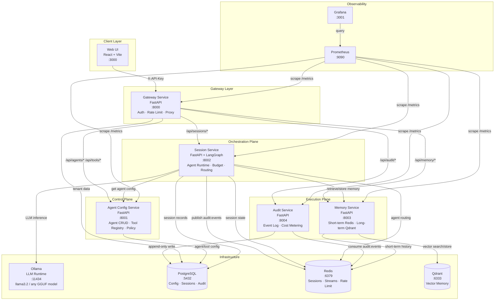
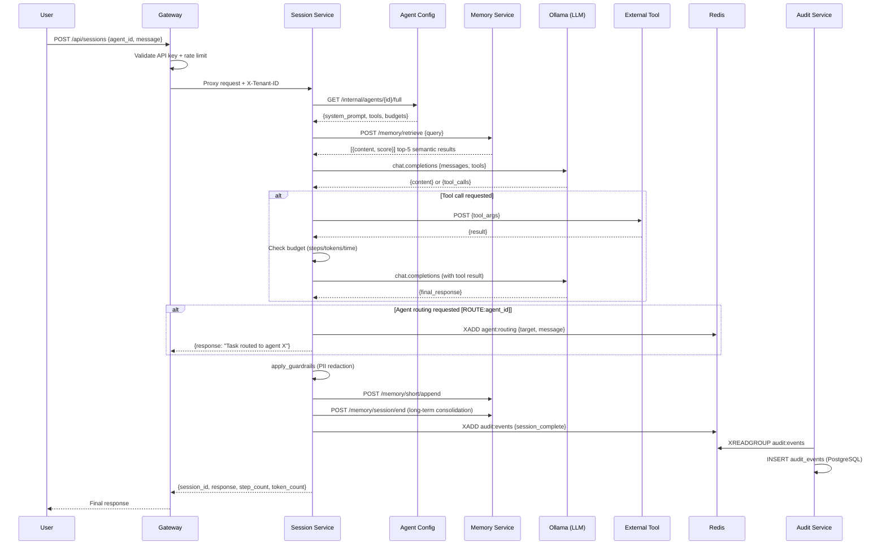
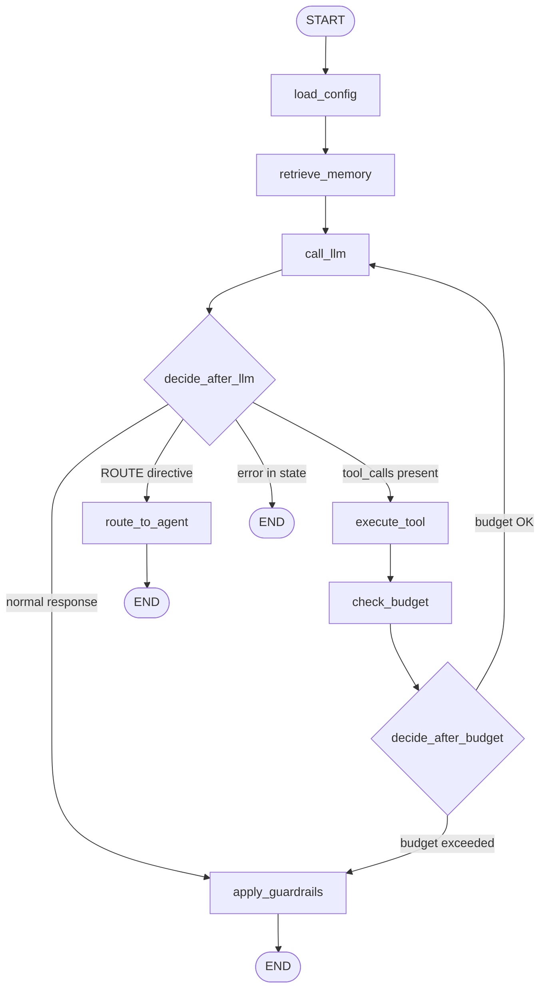
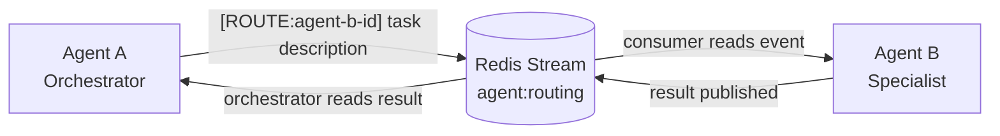
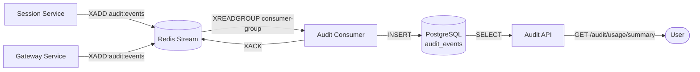

# Enterprise AI Agent Platform

A local-first, open-source platform for composing, deploying, and managing autonomous AI agents with tool calling, vector memory, multi-agent routing, and full audit trails — all running on a single machine via Docker Compose.

> **Designed for local development on Apple Silicon (M4 Max, 128 GB RAM).**
> Kubernetes-ready: every service is stateless, health-checked, and env-var configured.

---

## Table of Contents

- [System Architecture](#system-architecture)
- [Agent Turn Lifecycle](#agent-turn-lifecycle)
- [LangGraph Agent Graph](#langgraph-agent-graph)
- [Memory Architecture](#memory-architecture)
- [Multi-Agent Routing](#multi-agent-routing)
- [Audit Pipeline](#audit-pipeline)
- [Services](#services)
- [Quick Start](#quick-start)
- [Configuration](#configuration)
- [API Reference](#api-reference)
- [Running the Test Suite](#running-the-test-suite)
- [Observability](#observability)
- [Changing the LLM Model](#changing-the-llm-model)
- [Tenant Isolation](#tenant-isolation)
- [Production Path](#production-path)
- [Known Constraints](#known-constraints)
- [Future Plans](#future-plans)
- [Open Source Stack](#open-source-stack)

---

## System Architecture



---

## Agent Turn Lifecycle



---

## LangGraph Agent Graph

The session service runs each agent turn as a LangGraph `StateGraph`. The graph has seven nodes connected by conditional edges.



### Node Descriptions

| Node | Purpose |
|---|---|
| **load_config** | Fetch agent system prompt, model, budgets, and tool schemas from agent-config-service. Cached on multi-turn continuation. |
| **retrieve_memory** | If `memory_enabled`, query Qdrant for top-5 semantic memories using the last user message. Prepend results as a system context message. |
| **call_llm** | Build full conversation (system + history), call Ollama via OpenAI-compatible API, track token usage, preserve tool calls. |
| **execute_tool** | For each tool call in the last assistant message, look up the endpoint config and POST the arguments. Append tool result messages. |
| **check_budget** | Enforce `max_steps` (step count), `token_budget` (cumulative tokens), and `session_timeout_seconds` (wall-clock time). Sets `budget_exceeded=True` if any limit is hit. |
| **apply_guardrails** | Redact PII from the final assistant message: SSNs (`\d{3}-\d{2}-\d{4}` → `[REDACTED-SSN]`), credit cards (`\d{4}[- ]\d{4}[- ]\d{4}[- ]\d{4}` → `[REDACTED-CC]`). |
| **route_to_agent** | Detect `[ROUTE:target_agent_id]` prefix in LLM output. Publish routing event to `agent:routing` Redis Stream. |

---

## Memory Architecture

```mermaid
flowchart LR
    subgraph Short["Short-Term (Redis)"]
        direction TB
        SK[Key: memory:short:{tenant_id}:{session_id}]
        SL[JSON list — 50 message max]
        ST[TTL: 24 hours]
    end

    subgraph Long["Long-Term (Qdrant)"]
        direction TB
        LK[Collection: memory_{tenant_id}]
        LE[Embedding: all-MiniLM-L6-v2, 384-dim]
        LS[Similarity: COSINE > 0.4]
    end

    U([User message]) --> RM[retrieve_memory node]
    RM -->|semantic search top-5| Long
    Long -->|context prepended| LLM[call_llm node]
    LLM --> Response
    Response --> SA[/memory/short/append]
    SA --> Short
    Response --> SE[/memory/session/end]
    SE -->|last 10 msgs embedded| Long
    SE -->|clear session| Short
```

**Short-term memory** (Redis) stores the raw message history for a session. It is used to maintain the conversation context window and is automatically evicted after 24 hours or 50 messages.

**Long-term memory** (Qdrant) stores semantically embedded assistant messages per tenant. At session end, the memory service consolidates the session into Qdrant. On the next session, relevant memories are retrieved and prepended to the system context so the agent has cross-session awareness.

---

## Multi-Agent Routing



When an LLM response begins with `[ROUTE:agent_id]`, the session service:

1. Extracts the target agent ID and the delegated message
2. Publishes a routing event to the `agent:routing` Redis Stream with fields: `tenant_id`, `source_session_id`, `target_agent_id`, `message`, `timestamp`
3. Terminates the current graph run with a "Task routed" response

A consumer (separate agent session or worker) reads from `agent:routing`, creates a new session for the target agent, and publishes the result back for the orchestrator to pick up.

---

## Audit Pipeline



Events are published to the `audit:events` Redis Stream by the session service at each lifecycle point (`session_start`, `session_complete`, `session_turn`, `session_terminated`). The audit service consumer reads these with XREADGROUP (exactly-once delivery), writes them append-only to PostgreSQL, and ACKs. The audit REST API provides usage summaries, per-agent breakdowns, tool adoption stats, and session timelines.

---

## Services

| Service | Port | Role |
|---|---|---|
| `gateway-service` | 8000 | Public entry point: API key auth, rate limiting, reverse proxy |
| `agent-config-service` | 8001 | Agent CRUD, tool registry, agent–tool bindings, policy engine |
| `session-service` | 8002 | LangGraph agent runtime, multi-turn sessions, budget enforcement |
| `memory-service` | 8003 | Redis short-term + Qdrant long-term vector memory |
| `audit-service` | 8004 | Redis Streams consumer, append-only audit log, cost metering |
| `web-ui` | 3000 | React UI: agent builder, session monitor, tenant dashboard |
| `ollama` | 11434 | Local LLM runtime (llama3.2 default, any GGUF model) |
| `postgres` | 5432 | Persistent config, session records, audit log |
| `redis` | 6379 | Session state (AOF), Streams, rate limiting |
| `qdrant` | 6333 | Per-tenant vector collections for long-term memory |
| `prometheus` | 9090 | Metrics scraping from all services |
| `grafana` | 3001 | Pre-provisioned dashboards |

---

## Quick Start

### Prerequisites

- Docker Desktop with at least 16 GB RAM allocated
- ~20 GB free disk (Ollama model + Docker images)

### 1. Clone and configure

```bash
git clone <repo-url> enterprise-ai-agent-platform
cd enterprise-ai-agent-platform
cp .env.example .env
# Edit .env — at minimum change all `changeme-*` values
```

### 2. Start everything

```bash
docker compose up -d
```

First run takes 5–10 minutes: Docker builds all images, Ollama pulls `llama3.2` (~2 GB), and the sentence-transformers model downloads into the memory-service image.

### 3. Create your first tenant

```bash
curl -s -X POST http://localhost:8000/admin/tenants \
  -H "Content-Type: application/json" \
  -H "X-Admin-Secret: changeme-admin-secret" \
  -d '{"name": "My Company", "rate_limit_per_minute": 60}' | jq
```

Save the `api_key` from the response — it is shown only once.

### 4. Create an agent

```bash
export API_KEY="tap_<your-api-key>"

curl -s -X POST http://localhost:8000/api/agents \
  -H "X-API-Key: $API_KEY" \
  -H "Content-Type: application/json" \
  -d '{
    "name": "My First Agent",
    "system_prompt": "You are a helpful assistant.",
    "model": "llama3.2",
    "max_steps": 10,
    "token_budget": 8000,
    "memory_enabled": true
  }' | jq
```

### 5. Start a session

```bash
export AGENT_ID="<agent-uuid-from-above>"

curl -s -X POST http://localhost:8000/api/sessions \
  -H "X-API-Key: $API_KEY" \
  -H "Content-Type: application/json" \
  -d "{\"agent_id\": \"$AGENT_ID\", \"message\": \"Hello! What can you help me with?\"}" | jq
```

### 6. Open the Web UI

Navigate to **http://localhost:3000**

- Go to **Settings** and paste your API key
- Go to **Agents** → **New Agent** to create an agent visually
- Go to **Sessions** → start a session and chat

### 7. View dashboards

- Grafana: **http://localhost:3001** (admin / changeme-grafana)
- Prometheus: **http://localhost:9090**
- API docs: **http://localhost:8000/docs**

---

## Configuration

Copy `.env.example` to `.env` and edit before starting:

```bash
# ── PostgreSQL ──────────────────────────────────────────────────────────────
POSTGRES_DB=agentplatform
POSTGRES_USER=postgres
POSTGRES_PASSWORD=changeme-postgres

# ── Redis ───────────────────────────────────────────────────────────────────
REDIS_URL=redis://redis:6379

# ── Ollama (LLM) ────────────────────────────────────────────────────────────
OLLAMA_MODEL=llama3.2          # any model pulled into Ollama

# ── Auth secrets ────────────────────────────────────────────────────────────
ADMIN_SECRET=changeme-admin-secret        # gateway admin endpoints
INTERNAL_SECRET=changeme-internal-secret  # service-to-service calls

# ── Memory ──────────────────────────────────────────────────────────────────
EMBEDDING_MODEL=all-MiniLM-L6-v2   # sentence-transformers model (384-dim)
SHORT_TERM_TTL_HOURS=24             # Redis message TTL
SHORT_TERM_MAX_MESSAGES=50          # max messages per session

# ── Cost metering ───────────────────────────────────────────────────────────
TOKEN_COST_PER_UNIT=0.00001         # USD per token

# ── Grafana ─────────────────────────────────────────────────────────────────
GF_SECURITY_ADMIN_PASSWORD=changeme-grafana
```

### Per-agent configuration (via API)

Each agent stores its own runtime config:

| Field | Default | Description |
|---|---|---|
| `model` | `llama3.2` | Ollama model name |
| `system_prompt` | — | Agent personality and instructions |
| `max_steps` | `10` | Max tool-call iterations per turn |
| `token_budget` | `8000` | Max cumulative tokens per session |
| `session_timeout_seconds` | `300` | Max wall-clock time per session |
| `memory_enabled` | `false` | Enable long-term vector memory |

---

## API Reference

All calls go through the gateway at `http://localhost:8000`.

### Authentication

Every request (except `/admin/*` and `/health`) requires:
```
X-API-Key: tap_<your-api-key>
```

Admin endpoints require:
```
X-Admin-Secret: <your-admin-secret>
```

### Tenant Management (admin)

```bash
# Create tenant
POST /admin/tenants
{"name": "Acme Corp", "rate_limit_per_minute": 60}
→ {tenant_id, api_key, name}   # api_key shown once only

# List tenants
GET /admin/tenants

# Rotate API key
POST /admin/tenants/{tenant_id}/rotate-key
→ {tenant_id, api_key}

# Deactivate tenant
DELETE /admin/tenants/{tenant_id}
```

### Agents

```bash
# Create
POST /api/agents
{"name", "system_prompt", "model", "max_steps", "token_budget",
 "session_timeout_seconds", "memory_enabled"}

# List (paginated)
GET /api/agents?skip=0&limit=20
→ {items: [...], total: N}

# Get / Update / Delete
GET    /api/agents/{id}
PUT    /api/agents/{id}  {"name", "max_steps", ...}   # all fields optional
DELETE /api/agents/{id}
```

### Tools

```bash
# Register
POST /api/tools
{"name", "description", "endpoint_url", "http_method",
 "input_schema", "auth_type", "auth_config"}

# List / Get / Update / Delete
GET    /api/tools?skip=0&limit=20
GET    /api/tools/{id}
PUT    /api/tools/{id}
DELETE /api/tools/{id}

# Bind tool to agent
POST   /api/agents/{agent_id}/tools/{tool_id}
DELETE /api/agents/{agent_id}/tools/{tool_id}

# Authorize tool
PUT /api/agents/{agent_id}/tools/{tool_id}/authorize
{"is_authorized": true}

# List agent tools
GET /api/agents/{agent_id}/tools
```

### Sessions

```bash
# Start session (first turn)
POST /api/sessions
{"agent_id": "<uuid>", "message": "Hello"}
→ {session_id, agent_id, tenant_id, status, step_count,
   token_count, response, created_at}

# Continue session (multi-turn)
POST /api/sessions/{session_id}/messages
{"message": "Follow-up question"}

# List sessions
GET /api/sessions?limit=50&offset=0&status=completed

# Get session detail (includes full message history)
GET /api/sessions/{session_id}
→ {..., messages: [{role, content}, ...]}

# Terminate session
DELETE /api/sessions/{session_id}
```

### Memory (direct, for advanced use)

```bash
# Append to short-term
POST /api/memory/short/append
{"session_id", "role", "content"}

# Retrieve long-term (semantic search)
POST /api/memory/retrieve
{"session_id", "query", "top_k": 5}
→ {memories: [{content, score, metadata}, ...]}

# Consolidate session to long-term
POST /api/memory/session/end
{"session_id", "agent_id"}
```

### Audit & Usage

```bash
# Usage summary (last 24h by default)
GET /api/audit/usage/summary?from_ts=2024-01-01T00:00:00Z
→ {total_sessions, total_tokens, estimated_cost_usd, ...}

# Per-agent breakdown
GET /api/audit/usage/by-agent

# Tool adoption rankings
GET /api/audit/usage/tool-adoption

# All audit events
GET /api/audit/events?event_type=session_complete&limit=50

# Session event timeline
GET /api/audit/sessions/{session_id}/timeline
```

---

## Running the Test Suite

The E2E test suite runs against the live Docker Compose stack — no mocking.

### Prerequisites

```bash
pip install pytest httpx
# or install from pyproject.toml
pip install tests/
```

### Run all tests (~90 seconds)

```bash
cd tests
pytest -v
```

### Run with the helper script

```bash
./tests/run_tests.sh              # all tests
./tests/run_tests.sh -k health    # only health checks
./tests/run_tests.sh -x           # stop on first failure
```

### Run subsets

```bash
# Fast tests only (no LLM calls, ~12 seconds)
pytest test_01_health.py test_02_tenants.py test_03_agents.py test_04_tools.py

# LLM session tests
pytest test_05_sessions.py

# Full end-to-end flows
pytest test_08_e2e_flow.py
```

### Test coverage

| File | Tests | What it covers |
|---|---|---|
| `test_01_health.py` | 7 | All 5 services healthy, Prometheus scraping |
| `test_02_tenants.py` | 7 | Create/list tenant, auth, API key rotation, rate limiting |
| `test_03_agents.py` | 7 | Agent CRUD, tenant isolation |
| `test_04_tools.py` | 9 | Tool CRUD, bind/unbind/authorize |
| `test_05_sessions.py` | 11 | LLM sessions, multi-turn, token tracking, budget enforcement, PII redaction |
| `test_06_memory.py` | 5 | Short-term Redis, long-term Qdrant store/retrieve |
| `test_07_audit.py` | 7 | Usage summary, audit events, session timeline, tenant isolation |
| `test_08_e2e_flow.py` | 3 | Full lifecycle, new tenant onboarding, concurrent sessions |
| **Total** | **56** | |

---

## Observability

### Prometheus metrics (all services at `/metrics`)

| Metric | Service | Description |
|---|---|---|
| `gateway_requests_total` | gateway | Requests by tenant, method, status |
| `gateway_auth_failures_total` | gateway | Auth failures by reason |
| `sessions_created_total` | session | Sessions started |
| `session_steps_total` | session | Tool-call iterations |
| `llm_tokens_total` | session | Tokens consumed |
| `tool_calls_total` | session | External tool invocations |
| `budget_exceeded_total` | session | Budget limit hits by reason |
| `memory_append_total` | memory | Short-term append operations |
| `memory_retrieve_total` | memory | Semantic retrieval operations |
| `memory_store_long_total` | memory | Long-term store operations |
| `audit_events_consumed_total` | audit | Events processed from stream |

### Grafana dashboards

Pre-provisioned at **http://localhost:3001** (admin / changeme-grafana):

- **Agent Platform Overview** — sessions, tokens, tool calls, budget hits, gateway RPS, auth failures, memory ops, audit throughput

### Useful development commands

```bash
# View logs for a specific service
docker compose logs -f session-service

# Rebuild a single service after code changes
docker compose up -d --build session-service

# Access PostgreSQL
docker compose exec postgres psql -U postgres -d agentplatform

# Access Redis CLI
docker compose exec redis redis-cli

# Run all services except UI (API-only development)
docker compose up -d postgres redis qdrant ollama \
  gateway-service agent-config-service session-service memory-service audit-service
```

---

## Changing the LLM Model

Edit `.env`:

```bash
OLLAMA_MODEL=llama3.1:70b
```

Or pull any model manually:

```bash
docker exec -it enterprise-ai-agent-platform-ollama-1 ollama pull qwen2.5:72b
```

Then update the agent's `model` field via the API or UI.

**Recommended models for M4 Max 128 GB:**

| Model | Size | Strength |
|---|---|---|
| `llama3.2` | ~2 GB | Fast, good for most tasks |
| `llama3.1:8b` | ~5 GB | Better reasoning |
| `llama3.1:70b` | ~40 GB | Best reasoning, slower |
| `qwen2.5:72b` | ~45 GB | Excellent tool calling |
| `mistral:7b` | ~4 GB | Fast, multilingual |

The platform is LLM-agnostic. Point `OLLAMA_BASE_URL` at any OpenAI-compatible endpoint (Azure OpenAI, Bedrock, vLLM, etc.) without changing any service code.

---

## Tenant Isolation

| Layer | Mechanism |
|---|---|
| **Auth** | API keys are bcrypt-hashed; raw key shown once on creation |
| **Database** | All PostgreSQL queries filter by `tenant_id` from the validated API key |
| **Redis** | All keys prefixed with `tenant_id` |
| **Qdrant** | Separate vector collection per tenant (`memory_{tenant_id}`) |
| **Rate limiting** | Per-tenant requests/minute, configurable at tenant creation |
| **Audit** | All audit events tagged with `tenant_id`; queries are scoped |

---

## Production Path

This MVP runs locally. To move to production:

| Component | Local | Production |
|---|---|---|
| LLM | Ollama | Azure OpenAI / Bedrock (change `OLLAMA_BASE_URL`) |
| PostgreSQL | Docker volume | Managed RDS / Cloud SQL |
| Redis | Docker volume (AOF) | Upstash / ElastiCache |
| Qdrant | Docker volume | Qdrant Cloud |
| Services | Docker Compose | Kubernetes (stateless + health-checked) |
| Secrets | `.env` file | Vault / AWS Secrets Manager |
| Observability | Prometheus + Grafana | Datadog / Grafana Cloud |

**Estimated production capacity for 100 concurrent sessions:**

- Session service: 3 × pods (4 CPU / 16 GB each)
- All other services: 2 × pods (2 CPU / 4 GB each)
- Redis: 8 GB cluster
- PostgreSQL: db.t3.medium

---

## Known Constraints

| Constraint | Detail |
|---|---|
| **Single LLM backend** | All agents share the same Ollama instance. Separate model instances per agent are not supported. |
| **Synchronous sessions** | Each session request blocks until the full agent turn completes. Streaming responses are not yet implemented. |
| **No agent versioning** | Updating an agent's config takes effect immediately on all subsequent sessions, including continuations of existing sessions. |
| **Tool auth limited** | Tool authentication supports `none` and `api_key` types. OAuth/JWT flows are not implemented. |
| **No agent-to-agent result return** | The routing mechanism publishes to a Redis Stream but has no built-in result handback — consumers must implement their own completion signalling. |
| **Memory retrieval is global** | Long-term memory retrieval searches all of a tenant's memories, not just the current agent's. Cross-agent memory bleed is possible. |
| **No horizontal session scaling** | Session state is stored in Redis but the graph runs in-process. Sticky sessions are required if running multiple session-service pods. |
| **Qdrant no healthcheck** | The Qdrant image has no curl/wget, so Docker Compose cannot health-check it. Dependent services retry on connect. |
| **Local-only TLS** | No TLS termination is included. In production, use a load balancer (nginx, ALB) in front of the gateway. |

---

## Future Plans

### Short-term (next iteration)

- **Streaming responses** — Server-sent events (SSE) for real-time token streaming from Ollama to the client
- **Agent versioning** — Immutable agent config snapshots; sessions pin to the version active at creation time
- **OAuth2 / JWT tool auth** — Support for bearer-token and OAuth2 client credentials in tool configs
- **Web UI session chat** — Fully interactive chat interface with streaming and message history in the UI

### Medium-term

- **Multi-LLM routing** — Route different agents to different LLM backends (e.g., GPT-4o for complex tasks, llama3.2 for simple ones) based on agent config
- **Agent result handback** — Complete the multi-agent routing loop: target agent publishes results back to the source session via Redis
- **Agent-scoped memory** — Scope long-term memory retrieval to the calling agent ID, preventing cross-agent bleed
- **Webhook tool auth** — HMAC-signed outbound requests for tool endpoints that require request verification
- **Session replay** — Replay any past session step-by-step for debugging and auditability

### Long-term

- **Kubernetes Helm chart** — Production-ready Helm chart with HPA, PodDisruptionBudget, and NetworkPolicy for each service
- **Agent marketplace** — Publish, discover, and import community-built agent templates and tool integrations
- **Evaluation framework** — Run benchmark datasets against agents; track accuracy, latency, and cost regressions over time
- **Human-in-the-loop** — Pause agent execution at configurable checkpoints and route to a human approval queue before continuing
- **Federated multi-tenant LLM** — Per-tenant LLM endpoint overrides, allowing enterprise customers to bring their own Azure OpenAI or Bedrock deployments
- **Fine-tuning pipeline** — Export tenant session data in JSONL format for supervised fine-tuning of custom models
- **GraphQL API** — Optional GraphQL gateway alongside the REST API for flexible client queries

---

## Open Source Stack

| Component | License |
|---|---|
| FastAPI | MIT |
| LangGraph | MIT |
| Ollama | MIT |
| sentence-transformers | Apache 2.0 |
| Qdrant | Apache 2.0 |
| Redis | BSD |
| PostgreSQL | PostgreSQL License |
| Prometheus | Apache 2.0 |
| Grafana | AGPL-3.0 |
| React / Vite | MIT |
| httpx | BSD |
| SQLAlchemy | MIT |
